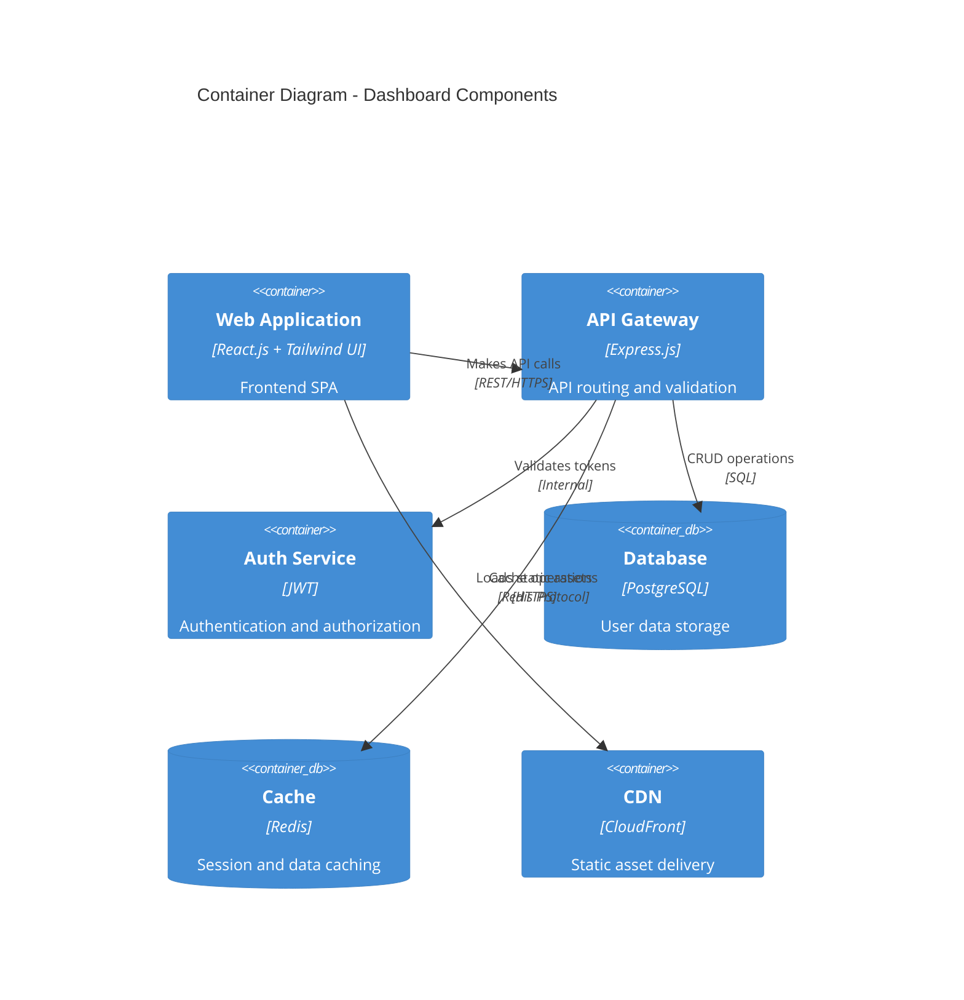
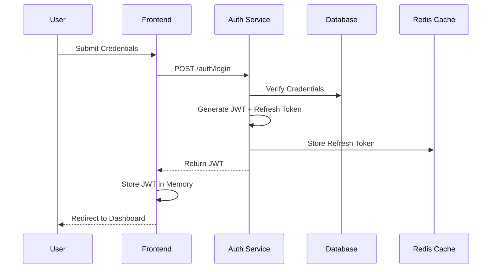

# Contributing to User Management Dashboard

Thank you for your interest in contributing to the User Management Dashboard project! This document provides comprehensive guidelines for contributing to our secure, centralized platform for user management.

## Table of Contents

- [Introduction](#introduction)
  - [Project Overview](#project-overview)
  - [Architecture Overview](#architecture-overview)
  - [Technology Stack](#technology-stack)
  - [Getting Started Guide](#getting-started-guide)
- [Development Setup](#development-setup)
  - [Prerequisites](#prerequisites)
  - [Installation Steps](#installation-steps)
  - [Environment Configuration](#environment-configuration)
  - [Troubleshooting Guide](#troubleshooting-guide)
- [Code Standards](#code-standards)
  - [ESLint Configuration](#eslint-configuration)
  - [Prettier Setup](#prettier-setup)
  - [TypeScript Guidelines](#typescript-guidelines)
  - [Component Structure](#component-structure)
  - [State Management](#state-management)
  - [Error Handling](#error-handling)
- [Git Workflow](#git-workflow)
  - [Branch Naming Convention](#branch-naming-convention)
  - [Commit Message Format](#commit-message-format)
  - [Pull Request Process](#pull-request-process)
  - [Code Review Guidelines](#code-review-guidelines)
  - [Merge Strategy](#merge-strategy)
- [Testing Requirements](#testing-requirements)
  - [Unit Testing (Jest)](#unit-testing-jest)
  - [Component Testing (React Testing Library)](#component-testing-react-testing-library)
  - [Integration Testing](#integration-testing)
  - [E2E Testing (Playwright)](#e2e-testing-playwright)
  - [Test Coverage Requirements](#test-coverage-requirements)
- [CI/CD Pipeline](#cicd-pipeline)
  - [GitHub Actions Configuration](#github-actions-configuration)
  - [Build Process](#build-process)
  - [Deployment Stages](#deployment-stages)
  - [Monitoring](#monitoring)
  - [Rollback Procedures](#rollback-procedures)
- [Documentation](#documentation)
  - [Code Documentation](#code-documentation)
  - [API Documentation](#api-documentation)
  - [Technical Documentation](#technical-documentation)
  - [Change Log Management](#change-log-management)
- [Security Guidelines](#security-guidelines)
  - [Authentication Implementation](#authentication-implementation)
  - [Data Protection](#data-protection)
  - [API Security](#api-security)
  - [Vulnerability Reporting](#vulnerability-reporting)
  - [Security Review Checklist](#security-review-checklist)
- [Performance Standards](#performance-standards)
  - [Performance Budgets](#performance-budgets)
  - [Optimization Techniques](#optimization-techniques)
  - [Monitoring Tools](#monitoring-tools)
  - [Browser Compatibility](#browser-compatibility)
  - [Mobile-First Guidelines](#mobile-first-guidelines)
- [Accessibility Standards](#accessibility-standards)
  - [WCAG 2.1 Compliance](#wcag-21-compliance)
  - [Accessibility Testing](#accessibility-testing)
  - [Screen Reader Support](#screen-reader-support)
  - [Keyboard Navigation](#keyboard-navigation)

## Introduction

### Project Overview

The User Management Dashboard is a modern web application built with React.js and Tailwind UI that provides a secure, centralized platform for managing user data and authentication. The system addresses the critical need for efficient user administration by offering a streamlined interface for viewing, editing, and managing user records with role-based access control.

Key objectives include:
- 50% reduction in time spent on user administration tasks
- 99.9% uptime during business hours
- 99.99% accuracy in user data management
- 90% positive feedback from system administrators

### Architecture Overview

The application follows a modern architecture with these key components:

- **Frontend**: React.js Single Page Application (SPA)
- **Backend**: Express.js API Gateway with microservices
- **Data Layer**: PostgreSQL database with Redis caching
- **Authentication**: JWT-based with role-based access control
- **Deployment**: Containerized with Docker on AWS ECS



### Technology Stack

- **Frontend**:
  - React.js 18.x
  - TypeScript 5.0+
  - Tailwind UI 3.x
  - React Query 4.x
  - React Router 6.x

- **Backend**:
  - Node.js 18.x LTS
  - Express.js
  - JWT authentication
  - Prisma/TypeORM

- **Data Storage**:
  - PostgreSQL 15+
  - Redis 7.x
  - S3-compatible storage

- **DevOps**:
  - Docker
  - AWS ECS
  - GitHub Actions

### Getting Started Guide

1. Read through this contribution guide completely
2. Review the README.md in the project root
3. Explore the technical documentation in `/docs`
4. Set up your local development environment
5. Pick an issue from our issue tracker to start contributing

## Development Setup

### Prerequisites

Before starting, ensure you have the following installed:

- Node.js 18.x LTS
- npm 9.x
- Git 2.x
- Docker and Docker Compose (for local development)
- A code editor (VS Code recommended)

### Installation Steps

1. Fork and clone the repository:
   ```bash
   git clone https://github.com/YOUR-USERNAME/user-management-dashboard.git
   cd user-management-dashboard
   ```

2. Install dependencies:
   ```bash
   npm install
   ```

3. Set up git hooks:
   ```bash
   npx husky install
   ```

4. Start the development server:
   ```bash
   npm run dev
   ```

The application will be available at `http://localhost:3000`

### Environment Configuration

1. Copy the example environment file:
   ```bash
   cp .env.example .env.local
   ```

2. Configure the environment variables in `.env.local`:
   ```
   # API Configuration
   REACT_APP_API_URL=http://localhost:8080/api/v1
   REACT_APP_AUTH_URL=http://localhost:8080/auth
   
   # Feature Flags
   REACT_APP_ENABLE_DARK_MODE=true
   REACT_APP_ENABLE_ANALYTICS=false
   
   # Development Settings
   NODE_ENV=development
   ```

3. For local API development, set up the backend services following instructions in `/api/README.md`

### Troubleshooting Guide

Common issues and solutions:

- **Module not found errors**: Ensure all dependencies are installed with `npm install`
- **TypeScript errors**: Run `npm run type-check` to identify type issues
- **API connection errors**: Verify the API is running and the `REACT_APP_API_URL` is correct
- **Build failures**: Check for lint errors with `npm run lint`
- **Docker issues**: Ensure Docker is running and ports are not in use

## Code Standards

### ESLint Configuration

We use ESLint to maintain code quality:

- Configuration is in `.eslintrc.js`
- Run linting with `npm run lint`
- Fix auto-fixable issues with `npm run lint:fix`

Our ESLint extends:
- `eslint:recommended`
- `plugin:react/recommended`
- `plugin:@typescript-eslint/recommended`
- `plugin:react-hooks/recommended`
- `plugin:jsx-a11y/recommended`

### Prettier Setup

We use Prettier for consistent code formatting:

- Configuration is in `.prettierrc`
- Run formatting with `npm run format`
- VS Code: Install Prettier extension and enable Format on Save
- Pre-commit hooks automatically format code

```json
// .prettierrc
{
  "printWidth": 100,
  "tabWidth": 2,
  "useTabs": false,
  "semi": true,
  "singleQuote": true,
  "trailingComma": "es5",
  "bracketSpacing": true,
  "arrowParens": "avoid"
}
```

### TypeScript Guidelines

- Use TypeScript for all new code
- Define proper interfaces and types
- Avoid using `any` type
- Use type inference when appropriate
- Export shared types from a central location

Example of good TypeScript usage:

```typescript
// User type definition
interface User {
  id: string;
  email: string;
  firstName: string;
  lastName: string;
  role: UserRole;
  isActive: boolean;
  createdAt: Date;
  updatedAt: Date;
}

// Role enum
enum UserRole {
  Admin = 'admin',
  User = 'user',
  Guest = 'guest',
}

// Function with proper typing
function formatUserName(user: User): string {
  return `${user.firstName} ${user.lastName}`;
}
```

### Component Structure

For React components:

- Use functional components with hooks
- One component per file
- Follow the single responsibility principle
- Use TypeScript for props definitions
- Implement proper error boundaries

Example component structure:

```tsx
import React from 'react';
import { User } from 'types/user';

interface UserCardProps {
  user: User;
  onEdit?: (id: string) => void;
  onDelete?: (id: string) => void;
}

export const UserCard: React.FC<UserCardProps> = ({ user, onEdit, onDelete }) => {
  const handleEdit = () => {
    if (onEdit) onEdit(user.id);
  };
  
  const handleDelete = () => {
    if (onDelete) onDelete(user.id);
  };
  
  return (
    <div className="p-4 border rounded shadow">
      <h3 className="text-lg font-medium">{user.firstName} {user.lastName}</h3>
      <p className="text-sm text-gray-500">{user.email}</p>
      <div className="flex mt-4 space-x-2">
        <button 
          className="px-2 py-1 bg-blue-500 text-white rounded" 
          onClick={handleEdit}
        >
          Edit
        </button>
        <button 
          className="px-2 py-1 bg-red-500 text-white rounded" 
          onClick={handleDelete}
        >
          Delete
        </button>
      </div>
    </div>
  );
};
```

### State Management

For effective state management:

- Use React Query for server state
- Use React Context for global UI state
- Use local state for component-specific state
- Implement proper loading and error states

Example React Query usage:

```tsx
import { useQuery, useMutation, useQueryClient } from 'react-query';
import { fetchUsers, updateUser } from 'api/users';

export function useUsers() {
  const queryClient = useQueryClient();
  
  const usersQuery = useQuery('users', fetchUsers, {
    staleTime: 60000, // 1 minute
    refetchOnWindowFocus: true,
  });
  
  const updateUserMutation = useMutation(updateUser, {
    onSuccess: () => {
      queryClient.invalidateQueries('users');
    },
  });
  
  return {
    users: usersQuery.data || [],
    isLoading: usersQuery.isLoading,
    error: usersQuery.error,
    updateUser: updateUserMutation.mutate,
  };
}
```

### Error Handling

Follow these error handling guidelines:

- Use try/catch for asynchronous operations
- Implement proper error boundaries for React components
- Create a centralized error handling utility
- Log errors to a monitoring service
- Display user-friendly error messages

Example error handling:

```tsx
import { ErrorBoundary } from 'components/ErrorBoundary';
import { errorLogger } from 'utils/errorLogger';

try {
  // Potentially error-causing code
  await api.updateUser(userData);
} catch (error) {
  // Log the error
  errorLogger.capture(error, {
    context: 'UserUpdate',
    userId: userData.id,
  });
  
  // Display user-friendly message
  showToast({
    type: 'error',
    message: 'Failed to update user. Please try again later.',
  });
}

// Component with error boundary
const UserProfile = () => (
  <ErrorBoundary fallback={<UserProfileErrorState />}>
    <UserProfileContent />
  </ErrorBoundary>
);
```

## Git Workflow

We follow GitHub flow for our development process.

### Branch Naming Convention

Follow this pattern for branch names:

- `feature/short-description` - For new features
- `bugfix/short-description` - For bug fixes
- `hotfix/short-description` - For urgent production fixes
- `docs/short-description` - For documentation changes
- `refactor/short-description` - For code refactoring

Examples:
- `feature/user-search`
- `bugfix/login-validation`
- `docs/api-documentation`

### Commit Message Format

We follow the Conventional Commits specification:

```
<type>[optional scope]: <description>

[optional body]

[optional footer(s)]
```

Types:
- `feat`: New feature
- `fix`: Bug fix
- `docs`: Documentation changes
- `style`: Formatting changes
- `refactor`: Code change that neither fixes a bug nor adds a feature
- `perf`: Performance improvements
- `test`: Adding or fixing tests
- `chore`: Changes to build process or auxiliary tools

Examples:
```
feat(user-table): add sorting functionality

Implement client-side sorting in the user table component

Closes #123
```

```
fix(auth): resolve token refresh issue

Fix the bug where tokens weren't properly refreshed when expired

Fixes #456
```

### Pull Request Process

1. Ensure your branch is up to date with the main branch
2. Run all tests locally before submitting a PR
3. Create a pull request against the `main` branch
4. Complete the PR template with all required information
5. Request reviews from relevant team members
6. Address review feedback promptly
7. Ensure all CI checks pass
8. Update documentation if necessary

### Code Review Guidelines

For effective code reviews:

- Review code within 24 hours when possible
- Check for adherence to coding standards
- Verify test coverage for new code
- Test the functionality locally if possible
- Provide constructive feedback
- Use GitHub's suggestion feature for small changes
- Approve only when all issues are addressed

### Merge Strategy

We use squash merging for all PRs:

- All commits in a PR are squashed into a single commit
- The squashed commit message should follow the conventional commit format
- Branch protection rules require:
  - At least 1 approving review
  - Passing build, test, and lint status checks
  - No merge conflicts

## Testing Requirements

### Unit Testing (Jest)

Write unit tests for all business logic:

- Each utility function should have corresponding tests
- Test success cases, edge cases, and error cases
- Aim for focused, small tests
- Use proper test descriptions
- Run with `npm test`

Example unit test:

```typescript
import { validateEmail } from 'utils/validation';

describe('validateEmail', () => {
  it('should return true for valid email addresses', () => {
    expect(validateEmail('user@example.com')).toBe(true);
    expect(validateEmail('name.surname@domain.co.uk')).toBe(true);
  });

  it('should return false for invalid email addresses', () => {
    expect(validateEmail('invalid-email')).toBe(false);
    expect(validateEmail('@example.com')).toBe(false);
    expect(validateEmail('user@')).toBe(false);
  });
  
  it('should handle edge cases properly', () => {
    expect(validateEmail('')).toBe(false);
    expect(validateEmail(' ')).toBe(false);
    expect(validateEmail(null as any)).toBe(false);
  });
});
```

### Component Testing (React Testing Library)

Test React components with React Testing Library:

- Focus on user interactions and behavior
- Test component rendering
- Test component interactivity
- Avoid testing implementation details
- Use proper queries (getByRole, getByLabelText, etc.)

Example component test:

```typescript
import { render, screen, fireEvent } from '@testing-library/react';
import userEvent from '@testing-library/user-event';
import { LoginForm } from 'components/LoginForm';

describe('LoginForm', () => {
  const mockSubmit = jest.fn();

  beforeEach(() => {
    mockSubmit.mockClear();
    render(<LoginForm onSubmit={mockSubmit} />);
  });

  it('should render email and password fields', () => {
    expect(screen.getByLabelText(/email/i)).toBeInTheDocument();
    expect(screen.getByLabelText(/password/i)).toBeInTheDocument();
    expect(screen.getByRole('button', { name: /login/i })).toBeInTheDocument();
  });

  it('should validate input fields', async () => {
    const loginButton = screen.getByRole('button', { name: /login/i });
    await userEvent.click(loginButton);
    
    expect(screen.getByText(/email is required/i)).toBeInTheDocument();
    expect(screen.getByText(/password is required/i)).toBeInTheDocument();
    expect(mockSubmit).not.toHaveBeenCalled();
  });

  it('should submit the form with valid data', async () => {
    await userEvent.type(screen.getByLabelText(/email/i), 'test@example.com');
    await userEvent.type(screen.getByLabelText(/password/i), 'Password123!');
    await userEvent.click(screen.getByRole('button', { name: /login/i }));
    
    expect(mockSubmit).toHaveBeenCalledWith({
      email: 'test@example.com',
      password: 'Password123!',
    });
  });
});
```

### Integration Testing

Write integration tests for key workflows:

- Test the interaction between multiple components
- Verify API integrations with mock servers
- Focus on critical user journeys
- Use React Testing Library for component integration
- Run with `npm run test:integration`

### E2E Testing (Playwright)

End-to-end tests verify complete workflows:

- Test critical user journeys from end to end
- Run tests across multiple browsers
- Include visual testing when appropriate
- Focus on high-value user flows
- Run with `npm run test:e2e`

Example Playwright test:

```typescript
import { test, expect } from '@playwright/test';

test.describe('User Management', () => {
  test.beforeEach(async ({ page }) => {
    // Login before each test
    await page.goto('/login');
    await page.fill('[name="email"]', 'admin@example.com');
    await page.fill('[name="password"]', 'admin123');
    await page.click('button[type="submit"]');
    await expect(page).toHaveURL('/dashboard');
  });

  test('should allow adding a new user', async ({ page }) => {
    // Navigate to users page
    await page.click('text=Users');
    
    // Click add new user
    await page.click('[data-testid="add-user-button"]');
    
    // Fill in the user form
    await page.fill('[name="firstName"]', 'John');
    await page.fill('[name="lastName"]', 'Doe');
    await page.fill('[name="email"]', 'john.doe@example.com');
    await page.selectOption('[name="role"]', 'user');
    
    // Submit the form
    await page.click('button[type="submit"]');
    
    // Verify success message
    await expect(page.locator('.toast-success')).toContainText('User created successfully');
    
    // Verify user appears in the table
    await expect(page.locator('table')).toContainText('John Doe');
  });
});
```

### Test Coverage Requirements

We maintain high test coverage standards:

- Minimum 80% code coverage required
- 100% coverage for critical path components
- Run coverage reports with `npm run test:coverage`
- Critical business logic requires 100% coverage
- Component tests required for all user-facing components

## CI/CD Pipeline

### GitHub Actions Configuration

Our CI/CD pipeline uses GitHub Actions:

- `.github/workflows/ci.yml` - Main CI workflow
- `.github/workflows/deploy-staging.yml` - Staging deployment
- `.github/workflows/deploy-production.yml` - Production deployment

CI pipeline is triggered on:
- Push to main branch
- Pull requests to main
- Manual triggers for deployments

### Build Process

The build process includes:

1. Install dependencies
2. Lint code
3. Type check TypeScript
4. Run unit and integration tests
5. Build the application
6. Create Docker image
7. Push image to container registry

Example GitHub Actions workflow:

```yaml
name: CI Pipeline

on:
  push:
    branches: [main]
  pull_request:
    branches: [main]

jobs:
  build-and-test:
    runs-on: ubuntu-latest
    steps:
      - uses: actions/checkout@v3
      - name: Set up Node.js
        uses: actions/setup-node@v3
        with:
          node-version: '18'
          cache: 'npm'
      - name: Install dependencies
        run: npm ci
      - name: Lint
        run: npm run lint
      - name: Type check
        run: npm run type-check
      - name: Test
        run: npm test
      - name: Build
        run: npm run build
      - name: Upload build artifacts
        uses: actions/upload-artifact@v3
        with:
          name: build
          path: build/
```

### Deployment Stages

Our deployment follows these stages:

1. **Development** - Automatic on push to main
   - Environment: `dev.example.com`
   - Automated tests run after deployment

2. **Staging** - Automatic after successful development deployment
   - Environment: `staging.example.com`
   - Manual approval required from tech lead

3. **Production** - Manual triggering with approval
   - Environment: `app.example.com`
   - Approval required from tech lead and product owner
   - Gradual rollout using blue/green deployment

### Monitoring

Post-deployment monitoring includes:

- Health check endpoints to verify application status
- New Relic monitoring for performance metrics
- Error tracking with appropriate alerting
- User analytics with Google Analytics
- Regular status reports to stakeholders

### Rollback Procedures

In case of deployment issues:

1. Automated health checks detect service degradation
2. Alerts are sent to the engineering team
3. Instant rollback to previous version can be triggered
4. Auto-rollback for critical metrics breaches
5. Post-incident analysis and documentation required

## Documentation

### Code Documentation

Document your code following these principles:

- Use descriptive variable and function names
- Add JSDoc comments for functions with complex logic
- Document non-obvious code behavior
- Keep comments up-to-date with code changes

Example JSDoc:

```typescript
/**
 * Validates a user object against schema requirements
 * 
 * @param user - The user object to validate
 * @returns A validation result with success flag and potential error messages
 * @throws ValidationError if user object is null or undefined
 * @example
 * ```ts
 * const result = validateUser({ name: 'John', email: 'invalid' });
 * if (!result.success) {
 *   console.error(result.errors);
 * }
 * ```
 */
function validateUser(user: UserInput): ValidationResult {
  // Implementation
}
```

### API Documentation

Document all API endpoints with:

- OpenAPI/Swagger specifications
- Request/response schemas
- Authentication requirements
- Example requests and responses
- Error codes and handling

API documentation should be stored in `/docs/api` and kept updated with each API change.

### Technical Documentation

Maintain technical documentation in `/docs`:

- Architecture diagrams
- Development setup guide
- Database schema
- Deployment instructions
- Security guidelines
- Troubleshooting guide

Use Markdown for documentation and include diagrams where helpful.

### Change Log Management

We maintain a CHANGELOG.md file following the Keep a Changelog format:

- Update with each release
- Categorize changes (Added, Changed, Fixed, etc.)
- Link to relevant issues and PRs
- Include version numbers and dates
- Credit contributors where appropriate

Example CHANGELOG entry:

```
## [1.2.0] - 2023-06-15

### Added
- User search functionality (#234)
- Role-based filtering in user table (#245)
- Export users to CSV feature (#252)

### Fixed
- Login form validation error messages (#260)
- User card layout issues on mobile devices (#265)
- Session timeout handling (#270)

### Changed
- Improved performance of user table rendering (#275)
- Updated authentication flow for better security (#280)
```

## Security Guidelines

### Authentication Implementation

Follow these authentication security practices:

- Use JWT for authentication with refresh tokens
- Store access tokens in memory only, never in localStorage
- Store refresh tokens in HTTP-only cookies
- Implement proper CSRF protection
- Set appropriate token expiration (15 minutes for access tokens)
- Validate JWT signature and claims on each request

Authentication flow:



### Data Protection

Protect sensitive data with:

- Data encryption at rest using AES-256
- TLS 1.3 for all communications
- Field-level encryption for PII
- Proper data sanitization for all inputs
- Role-based access control for data
- Audit logging for sensitive operations

Example data protection approach:

```typescript
// Define sensitive fields
const sensitiveFields = ['ssn', 'birthDate', 'address'];

// Encrypt sensitive data before storing
async function encryptSensitiveUserData(user) {
  const encryptedUser = { ...user };
  
  for (const field of sensitiveFields) {
    if (user[field]) {
      encryptedUser[field] = await encryptField(user[field]);
    }
  }
  
  return encryptedUser;
}

// Decrypt when retrieving
async function decryptUserData(user, role) {
  // Check if user has permission to see decrypted data
  if (!canAccessSensitiveData(role)) {
    return redactSensitiveFields(user);
  }
  
  const decryptedUser = { ...user };
  
  for (const field of sensitiveFields) {
    if (user[field]) {
      decryptedUser[field] = await decryptField(user[field]);
    }
  }
  
  return decryptedUser;
}
```

### API Security

Secure all API endpoints with:

- Input validation using schema validation
- Rate limiting (100 requests/minute per user)
- Proper CORS configuration
- Authentication middleware
- Authorization checks
- Security headers

Example security headers:

```javascript
// Security middleware
app.use((req, res, next) => {
  // Content Security Policy
  res.setHeader(
    'Content-Security-Policy',
    "default-src 'self'; script-src 'self'; style-src 'self'; img-src 'self' data:;"
  );
  
  // Prevent clickjacking
  res.setHeader('X-Frame-Options', 'DENY');
  
  // Prevent MIME type sniffing
  res.setHeader('X-Content-Type-Options', 'nosniff');
  
  // HSTS
  res.setHeader(
    'Strict-Transport-Security',
    'max-age=31536000; includeSubDomains'
  );
  
  // XSS Protection
  res.setHeader('X-XSS-Protection', '1; mode=block');
  
  next();
});
```

### Vulnerability Reporting

Security vulnerabilities should be reported:

1. Email security@example.com with details
2. Do not disclose publicly until resolved
3. Include steps to reproduce
4. Provide impact assessment if possible
5. Reports will be acknowledged within 24 hours
6. Updates on fix progress will be provided

We follow responsible disclosure practices and recognize security researchers who report valid vulnerabilities.

### Security Review Checklist

Before deploying, complete this security checklist:

- Authentication is properly implemented
- Authorization checks exist for all protected resources
- Input validation is thorough and covers all user inputs
- No sensitive data is exposed in logs or error messages
- All dependencies are up-to-date and scanned for vulnerabilities
- CSRF, XSS, and injection protections are implemented
- Rate limiting and brute force protections are in place
- Security headers are properly configured
- Audit logging is implemented for sensitive actions
- Backup and recovery procedures are tested

## Performance Standards

### Performance Budgets

We enforce these performance budgets:

- Total bundle size: max 250KB (gzipped)
- First Contentful Paint: < 1.5s on 4G connection
- Time to Interactive: < 3.5s on 4G connection
- Lighthouse Performance score: minimum 90
- Core Web Vitals: All in "good" range

Performance is monitored in CI with Lighthouse CI and in production with real user monitoring.

### Optimization Techniques

Implement these performance optimizations:

- Code splitting with React.lazy() and dynamic imports
- Tree shaking through ES modules and proper imports
- Lazy loading images and non-critical resources
- Component memoization with React.memo()
- Virtual lists for large data sets
- Debounced search inputs
- Cache API responses with React Query

Example code splitting:

```typescript
// Lazy load user management page
const UserManagement = React.lazy(() => import('./pages/UserManagement'));

function App() {
  return (
    <Routes>
      <Route path="/" element={<Dashboard />} />
      <Route 
        path="/users" 
        element={
          <Suspense fallback={<LoadingSpinner />}>
            <UserManagement />
          </Suspense>
        } 
      />
    </Routes>
  );
}
```

### Monitoring Tools

We use these tools to monitor performance:

- Lighthouse for overall performance scores
- New Relic for server-side performance
- Core Web Vitals reporting
- Custom performance metrics tracking
- User-centric performance monitoring

### Browser Compatibility

Support these browsers and versions:

- Chrome (last 2 versions)
- Firefox (last 2 versions)
- Safari (last 2 versions)
- Edge (last 2 versions)

Use feature detection and progressive enhancement where appropriate.

### Mobile-First Guidelines

Follow these mobile-first principles:

- Design for mobile screens first, then enhance for larger screens
- Use responsive design with appropriate breakpoints
  - sm: 640px
  - md: 768px
  - lg: 1024px
  - xl: 1280px
- Optimize for touch interaction on mobile devices
- Test on real mobile devices, not just emulators
- Implement appropriate loading states for slower connections

## Accessibility Standards

### WCAG 2.1 Compliance

All development must comply with WCAG 2.1 Level AA standards:

- Proper semantic HTML structure
- Sufficient color contrast (minimum 4.5:1 for normal text)
- Text resizing without loss of functionality
- Keyboard accessibility for all interactive elements
- Alternative text for images
- Proper heading structure

### Accessibility Testing

Test accessibility with:

- Automated tools like axe-core and Lighthouse
- Manual keyboard navigation testing
- Screen reader testing with NVDA and VoiceOver
- Color contrast analyzers
- Include accessibility checks in CI pipeline

### Screen Reader Support

Ensure screen reader compatibility:

- Use semantic HTML elements
- Add aria-labels where appropriate
- Implement proper focus management
- Test with popular screen readers
- Create accessible form inputs

Example accessible form input:

```html
<div class="form-group">
  <label for="email-input" id="email-label">Email Address</label>
  <input 
    id="email-input"
    type="email"
    aria-labelledby="email-label"
    aria-describedby="email-hint email-error"
    aria-required="true"
    name="email"
  />
  <p id="email-hint" class="hint">Enter your company email address</p>
  <p id="email-error" class="error" aria-live="polite"></p>
</div>
```

### Keyboard Navigation

Ensure complete keyboard accessibility:

- All interactive elements must be focusable
- Visible focus indicators for all elements
- Logical tab order follows visual order
- No keyboard traps
- Implement skip links for navigation
- Support standard keyboard shortcuts

Test all user flows using keyboard-only navigation.