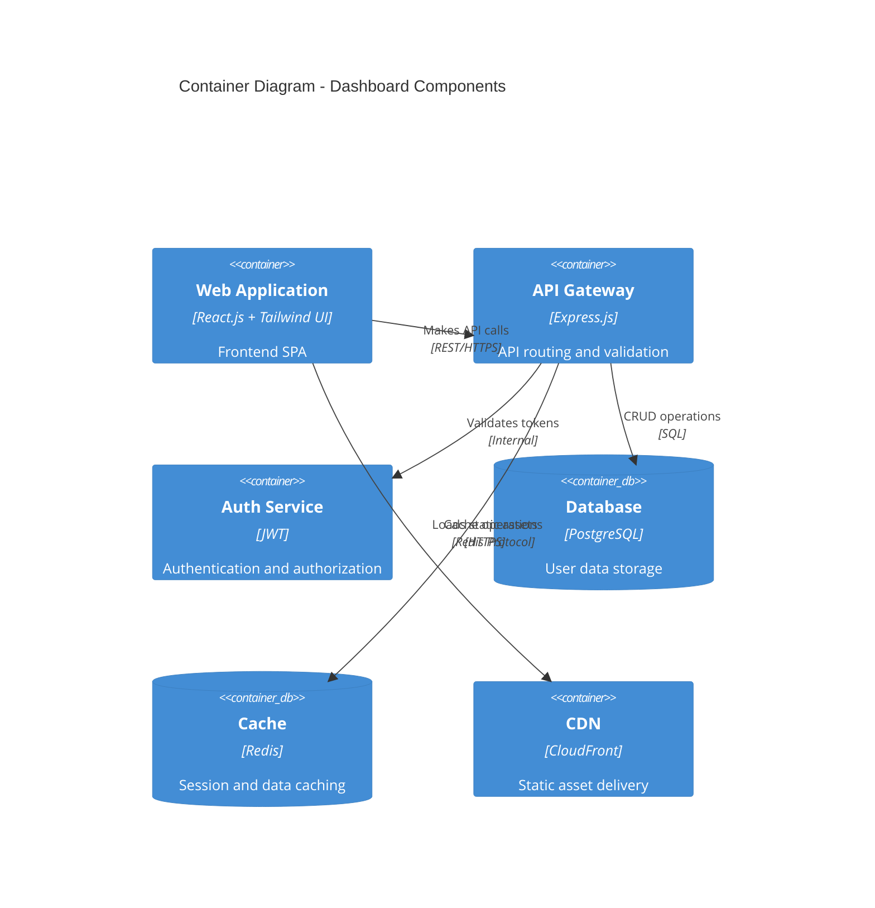

# User Management Dashboard

[](https://github.com/organization/user-management-dashboard/actions)
[](https://codecov.io/gh/organization/user-management-dashboard)
[](https://libraries.io/github/organization/user-management-dashboard)
[](https://github.com/organization/user-management-dashboard/security)
[](LICENSE)

A modern, secure, and scalable user management solution built with React.js and Tailwind UI, providing enterprise-grade user administration capabilities with role-based access control.

## Project Overview

The User Management Dashboard is a comprehensive web application designed to address the critical need for efficient user administration in enterprise environments. This solution provides:

- **Centralized User Management**: Single platform for all user administration tasks
- **Role-Based Access Control**: Granular permissions based on user roles
- **Security-First Design**: Enterprise-grade authentication with JWT and data protection
- **Modern User Experience**: Responsive interface built with React.js and Tailwind UI
- **Performance Optimized**: 99.9% uptime with efficient resource utilization

Key performance targets include 50% reduction in administration time, 99.9% uptime during business hours, and 99.99% accuracy in user data management.

## Features

### Authentication & Authorization
- Secure JWT-based authentication with refresh tokens
- Role-based access control with fine-grained permissions
- Password policies with strength requirements
- MFA support for enhanced security
- Session management with idle timeout

### User Management
- Complete CRUD operations for user records
- Bulk user operations
- Field-level validation with real-time feedback
- Comprehensive data export functionality
- User profile management

### Data Visualization
- Interactive data tables with sorting and filtering
- Real-time updates via WebSocket
- Customizable views and layouts
- Responsive design for all device sizes
- Advanced search capabilities

### Audit & Compliance
- Comprehensive audit logging
- GDPR, SOC2, and HIPAA compliance tools
- Data retention policy enforcement
- User action history tracking
- Compliance reporting

## Architecture

The User Management Dashboard follows a modern architecture designed for scalability, security, and maintainability.

### High-Level Architecture



### Frontend Architecture

- **UI Layer**: React.js components with Tailwind UI
- **State Management**: React Query for server state, Context API for application state
- **Routing**: React Router with code-splitting
- **API Layer**: Axios with interceptors for authentication

### Backend Architecture

- **API Gateway**: Express.js for route handling and validation
- **Authentication**: JWT-based service with refresh token rotation
- **Data Access**: ORM for database operations with connection pooling
- **Caching**: Redis for session storage and performance optimization

### Deployment Architecture

The application is deployed using containerization and orchestration for maximum scalability and reliability:

- **Environment Strategy**: Development → Testing → Staging → Production
- **Deployment Method**: Blue/Green deployment for zero downtime
- **Scaling**: Auto-scaling based on CPU utilization (2-10 instances)
- **High Availability**: Multi-AZ deployment with load balancing

## Tech Stack

### Frontend
- **Framework**: React.js 18.x
- **Language**: TypeScript 5.0+
- **Styling**: Tailwind UI 3.x
- **State Management**: React Query 4.x
- **Routing**: React Router 6.x
- **Build Tool**: Vite

### Backend
- **Runtime**: Node.js 18.x LTS
- **API Framework**: Express.js
- **Authentication**: JWT
- **ORM**: Prisma/TypeORM
- **Validation**: Joi/Zod

### Data Storage
- **Database**: PostgreSQL 15+
- **Cache**: Redis 7.x
- **File Storage**: S3-compatible

### DevOps & Infrastructure
- **Containerization**: Docker
- **Orchestration**: AWS ECS
- **CI/CD**: GitHub Actions
- **Monitoring**: New Relic, ELK Stack
- **CDN**: CloudFront

## Prerequisites

Before you begin, ensure you have met the following requirements:

- **Node.js**: v18.x LTS or later
- **npm**: v9.x or later
- **Docker**: Latest stable version (for local development with containers)
- **Git**: v2.x or later
- **AWS CLI**: Latest version (for deployment)

For security tools and scanning:
- Snyk CLI
- SonarQube Scanner
- OWASP Dependency Check

## Installation

### Development Environment Setup

1. Clone the repository
   ```bash
   git clone https://github.com/organization/user-management-dashboard.git
   cd user-management-dashboard
   ```

2. Install dependencies
   ```bash
   npm install
   ```

3. Set up environment variables
   ```bash
   cp .env.example .env.local
   # Edit .env.local with your configuration
   ```

4. Start the development server
   ```bash
   npm run dev
   ```

5. Run the application with Docker (optional)
   ```bash
   docker-compose up -d
   ```

### Production Deployment

1. Build the application
   ```bash
   npm run build
   ```

2. Deploy using the CI/CD pipeline
   ```bash
   # Deployment is automated through GitHub Actions
   # See .github/workflows/deploy.yml for details
   ```

3. Manual deployment to AWS (if needed)
   ```bash
   aws ecr get-login-password --region us-east-1 | docker login --username AWS --password-stdin [AWS-ACCOUNT-ID].dkr.ecr.us-east-1.amazonaws.com
   docker build -t user-management-dashboard .
   docker tag user-management-dashboard:latest [AWS-ACCOUNT-ID].dkr.ecr.us-east-1.amazonaws.com/user-management-dashboard:latest
   docker push [AWS-ACCOUNT-ID].dkr.ecr.us-east-1.amazonaws.com/user-management-dashboard:latest
   ```

## Development

### Directory Structure

```
user-management-dashboard/
├── .github/                # GitHub Actions workflows
├── docs/                   # Documentation files
├── public/                 # Static assets
├── src/
│   ├── api/                # API client and services
│   ├── components/         # Reusable React components
│   ├── context/            # React Context providers
│   ├── hooks/              # Custom React hooks
│   ├── layouts/            # Page layout components
│   ├── pages/              # Page components
│   ├── types/              # TypeScript type definitions
│   ├── utils/              # Utility functions
│   ├── App.tsx             # Main application component
│   └── index.tsx           # Application entry point
├── .env.example            # Example environment variables
├── docker-compose.yml      # Docker Compose configuration
├── Dockerfile              # Docker build configuration
├── package.json            # Dependencies and scripts
├── tsconfig.json           # TypeScript configuration
└── README.md               # Project documentation
```

### Code Standards

- **Linting**: ESLint with TypeScript and React rules
- **Formatting**: Prettier
- **Typing**: Strict TypeScript typing
- **Testing**: Jest and React Testing Library

### Development Workflow

1. Create a feature branch from `main`
2. Develop and test your changes locally
3. Ensure all tests pass with `npm test`
4. Submit a pull request for review
5. After approval, changes will be merged to `main`

For more details, see the [Contribution Guidelines](CONTRIBUTING.md).

## Testing

The project includes comprehensive testing at multiple levels:

### Unit Testing

```bash
# Run unit tests
npm run test

# Run with coverage report
npm run test:coverage
```

### Integration Testing

```bash
# Run integration tests
npm run test:integration
```

### End-to-End Testing

```bash
# Run E2E tests with Playwright
npm run test:e2e

# Run in specific browsers
npm run test:e2e:chrome
```

### Performance Testing

```bash
# Run Lighthouse performance tests
npm run test:performance
```

### Security Testing

```bash
# Run security scans
npm run security:scan

# Check for vulnerable dependencies
npm run security:deps
```

## Deployment

### Environment Configuration

The application supports multiple deployment environments:

- **Development**: For active development
- **Testing**: For QA and testing
- **Staging**: Pre-production environment mirroring production
- **Production**: Live environment with high availability

### Deployment Process

The deployment process is automated through GitHub Actions:

1. Code is pushed to the `main` branch
2. CI pipeline runs tests and builds the application
3. Docker image is created and pushed to ECR
4. ECS service is updated with the new image
5. Blue/Green deployment ensures zero downtime

### Monitoring and Scaling

- **Metrics**: CPU, memory, and request latency monitoring
- **Logging**: Centralized logging with ELK Stack
- **Alerting**: Automated alerts for system issues
- **Scaling**: Auto-scaling based on resource utilization

## Security

### Authentication

- JWT-based authentication with secure token handling
- Refresh token rotation for extended sessions
- HTTP-only cookies for secure token storage
- CSRF protection with custom request headers

### Data Protection

- All data encrypted at rest (AES-256)
- TLS 1.3 for all data in transit
- Field-level encryption for sensitive PII
- Role-based access control for all resources

### API Security

- Input validation with schema validation
- Rate limiting (100 requests/minute per user)
- Security headers (CSP, HSTS, etc.)
- Regular security scanning and penetration testing

### Compliance

- GDPR compliant data handling
- SOC2 auditing capabilities
- HIPAA-ready security features
- Regular security assessments

## Monitoring

### Application Performance Monitoring

- **New Relic**: Real-time performance monitoring
- **Custom Metrics**: Business-specific KPIs
- **Error Tracking**: Centralized error logging
- **User Analytics**: Usage patterns and behavior

### Health Checks

- Automated health endpoints
- Service availability monitoring
- Database connection monitoring
- Cache availability checks

### Alerting

- Incident response automation
- Escalation policies for critical issues
- On-call rotation management
- Post-incident analysis tools

## Contributing

We welcome contributions to the User Management Dashboard project! Please see our [Contribution Guidelines](CONTRIBUTING.md) for details on:

- Development setup
- Coding standards
- Git workflow
- Pull request process
- Testing requirements
- Documentation

## License

This project is licensed under the MIT License - see the [LICENSE](LICENSE) file for details.