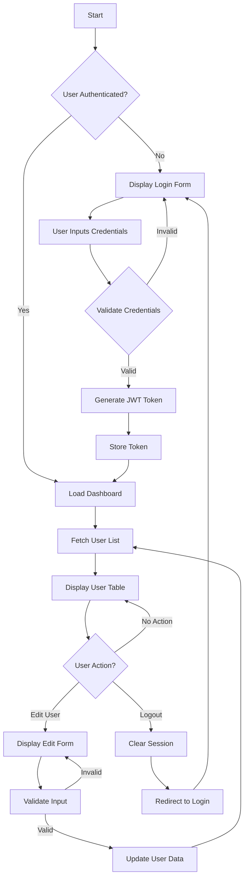
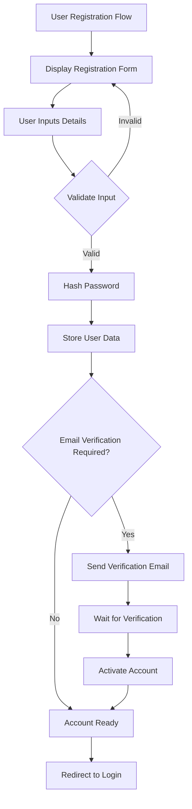
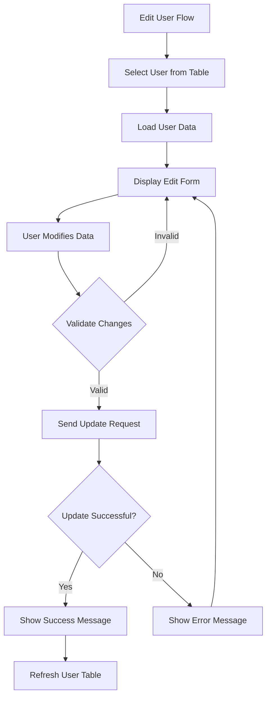
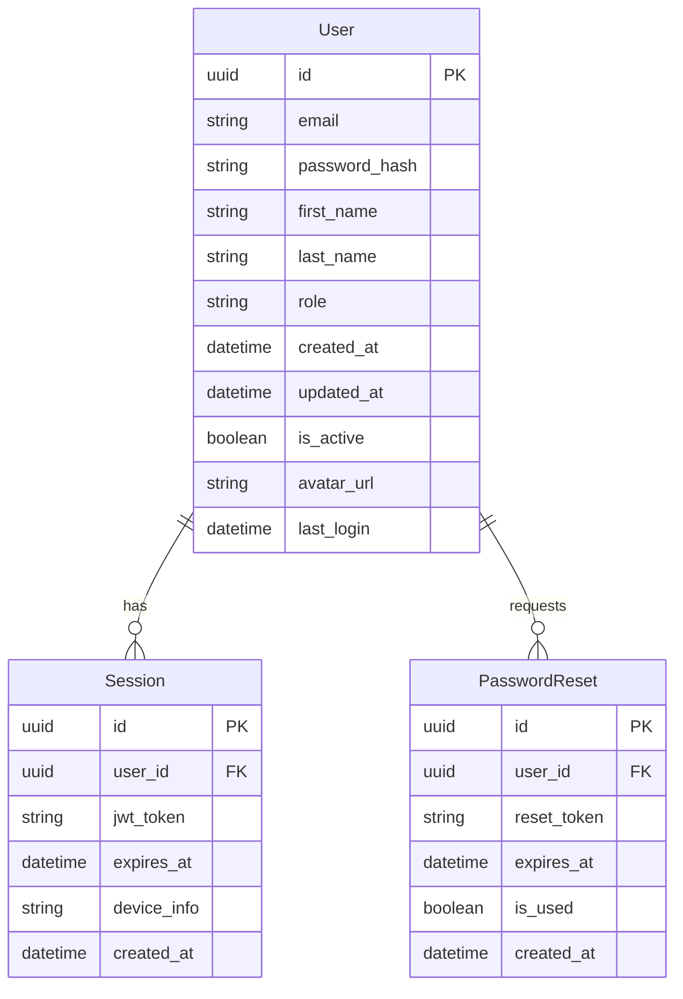
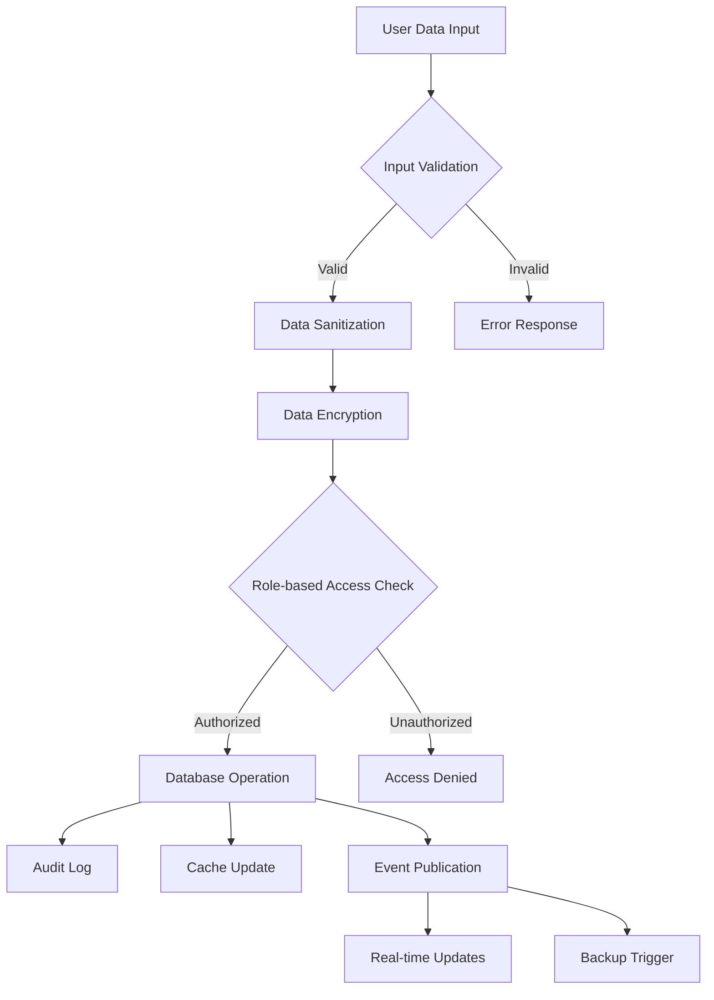

# Product Requirements Document (PRD)

# 1. INTRODUCTION

## 1.1 Purpose

This Product Requirements Document (PRD) outlines the comprehensive specifications and requirements for developing a user management dashboard web application. The document serves as a reference for developers, project managers, stakeholders, and quality assurance teams involved in the development and implementation process.

## 1.2 Scope

The user management dashboard is a web-based application built using React.js and Tailwind UI that provides authenticated access to user data management functionality. The system encompasses:

- User authentication and authorization system
- Secure user registration and login capabilities
- Interactive dashboard interface displaying user data in tabular format
- User data management functionality including viewing and editing capabilities
- Responsive design for various screen sizes and devices
- Role-based access control for data manipulation

The application aims to streamline user management processes by providing a centralized, secure platform for handling user data while maintaining a modern, intuitive user interface through Tailwind UI components.

# 2. PRODUCT DESCRIPTION

## 2.1 Product Perspective

The user management dashboard is a standalone web application that operates within modern web browsers. It integrates with:

- Backend authentication services for user verification
- Database systems for storing user information
- Modern web standards and protocols (HTTPS, REST APIs)
- Existing user data infrastructure

The system architecture follows a client-server model where the React.js frontend communicates with backend services through secure API endpoints.

## 2.2 Product Functions

The primary functions of the system include:

- User Authentication
  - Registration with email verification
  - Secure login/logout functionality
  - Password reset capabilities
- User Management
  - Display comprehensive user data in sortable tables
  - Real-time user data editing
  - Field validation and error handling
- Dashboard Features
  - Responsive data visualization
  - Search and filter capabilities
  - Pagination for large datasets
- Administrative Controls
  - User role management
  - Access control enforcement
  - Audit logging of changes

## 2.3 User Characteristics

The system targets three main user personas:

1. System Administrators

   - Technical expertise: High
   - Frequency of use: Daily
   - Needs: Complete system access, user management capabilities

2. Regular Users

   - Technical expertise: Medium
   - Frequency of use: Weekly
   - Needs: Basic data viewing and editing capabilities

3. Guest Users

   - Technical expertise: Low
   - Frequency of use: Occasional
   - Needs: Limited view access and self-registration

## 2.4 Constraints

- Technical Constraints

  - Must be built using React.js and Tailwind UI
  - Browser compatibility requirements (Chrome, Firefox, Safari, Edge)
  - Responsive design requirements for screens 320px and larger

- Security Constraints

  - GDPR compliance for user data handling
  - Secure password storage and transmission
  - Session management requirements

- Performance Constraints

  - Page load time under 3 seconds
  - Support for minimum 1000 concurrent users
  - Maximum 100ms response time for data operations

## 2.5 Assumptions and Dependencies

Assumptions:

- Users have modern web browsers with JavaScript enabled
- Stable internet connection available
- Users have basic computer literacy
- Server infrastructure supports real-time data operations

Dependencies:

- React.js framework (v18 or higher)
- Tailwind UI component library
- Backend API services
- Authentication service availability
- Database system uptime
- Modern browser features (localStorage, fetch API)

# 3. PROCESS FLOWCHART







# 4. FUNCTIONAL REQUIREMENTS

## 4.1 Authentication System

### ID: F001

### Description

User authentication system enabling secure access to the dashboard

### Priority: High

### Requirements

| Requirement ID | Description | Acceptance Criteria |
| --- | --- | --- |
| F001.1 | User registration with email and password | - Form validates email format<br>- Password meets security requirements (8+ chars, special chars)<br>- Duplicate email prevention |
| F001.2 | User login functionality | - JWT token generation<br>- Secure credential validation<br>- Remember me option |
| F001.3 | Password reset capability | - Email-based reset flow<br>- Secure reset link generation<br>- 24-hour link expiration |
| F001.4 | Session management | - Auto logout after 30 minutes of inactivity<br>- Secure token storage<br>- Multiple device session handling |

## 4.2 User Management Dashboard

### ID: F002

### Description

Interactive dashboard displaying user data in tabular format

### Priority: High

### Requirements

| Requirement ID | Description | Acceptance Criteria |
| --- | --- | --- |
| F002.1 | User data table display | - Sortable columns<br>- Pagination (10 items per page)<br>- Search functionality |
| F002.2 | User data editing | - Inline editing capability<br>- Form validation<br>- Real-time updates |
| F002.3 | User filtering | - Filter by role<br>- Filter by status<br>- Multiple filter combination |
| F002.4 | Data export | - CSV export option<br>- Selected fields export<br>- Export history logging |

## 4.3 User Profile Management

### ID: F003

### Description

Individual user profile viewing and editing capabilities

### Priority: Medium

### Requirements

| Requirement ID | Description | Acceptance Criteria |
| --- | --- | --- |
| F003.1 | Profile viewing | - Display all user details<br>- Activity history<br>- Role information |
| F003.2 | Profile editing | - Field-level validation<br>- Image upload for avatar<br>- Change email with verification |
| F003.3 | Password management | - Current password verification<br>- Password strength indicator<br>- Password history check |

## 4.4 Error Handling

### ID: F004

### Description

Comprehensive error management and user feedback system

### Priority: Medium

### Requirements

| Requirement ID | Description | Acceptance Criteria |
| --- | --- | --- |
| F004.1 | Form validation errors | - Clear error messages<br>- Field-specific highlighting<br>- Real-time validation |
| F004.2 | API error handling | - User-friendly error messages<br>- Automatic retry mechanism<br>- Error logging |
| F004.3 | Network error handling | - Offline mode detection<br>- Data recovery after reconnection<br>- Connection status indicator |

## 4.5 Responsive Design

### ID: F005

### Description

Mobile-responsive implementation of all dashboard features

### Priority: High

### Requirements

| Requirement ID | Description | Acceptance Criteria |
| --- | --- | --- |
| F005.1 | Mobile layout adaptation | - Breakpoint-specific layouts<br>- Touch-friendly controls<br>- Mobile-optimized tables |
| F005.2 | Component responsiveness | - Flexible grid system<br>- Responsive typography<br>- Adaptive navigation menu |
| F005.3 | Performance optimization | - Lazy loading for images<br>- Minimized bundle size<br>- Optimized rendering |

# 5. NON-FUNCTIONAL REQUIREMENTS

## 5.1 Performance Requirements

| Metric | Requirement | Description |
| --- | --- | --- |
| Response Time | \< 2 seconds | Dashboard page initial load time |
| API Response | \< 100ms | Backend API response time for data operations |
| Client-side Operations | \< 50ms | UI updates and data manipulations |
| Concurrent Users | 1000+ | System must handle 1000+ simultaneous users |
| Resource Usage | \< 60% | CPU and memory usage under normal load |
| Network Bandwidth | \< 1MB | Initial page load size including assets |

## 5.2 Safety Requirements

| Requirement | Description |
| --- | --- |
| Data Backup | Automated daily backups with 30-day retention |
| Failure Recovery | Automatic system recovery within 5 minutes of failure |
| Data Validation | Input sanitization to prevent data corruption |
| Error Logging | Comprehensive error tracking and notification system |
| Rollback Capability | Ability to restore data to previous states |
| Redundancy | Hot-standby system for critical components |

## 5.3 Security Requirements

| Requirement | Description |
| --- | --- |
| Authentication | JWT-based authentication with refresh tokens |
| Password Security | Bcrypt hashing with minimum 12 rounds |
| Data Encryption | AES-256 encryption for sensitive data at rest |
| Transport Security | TLS 1.3 for all data transmission |
| Session Management | 30-minute idle timeout with forced logout |
| Access Control | Role-based access control (RBAC) implementation |
| API Security | Rate limiting, CORS policies, and request validation |

## 5.4 Quality Requirements

### 5.4.1 Availability

- System uptime: 99.9% (excluding planned maintenance)
- Maximum planned downtime: 4 hours per month
- Unplanned downtime resolution: \< 2 hours

### 5.4.2 Maintainability

- Modular architecture with component reusability
- Comprehensive documentation for all APIs
- Automated testing coverage \> 80%
- Clear code structure following React.js best practices

### 5.4.3 Usability

- Intuitive navigation requiring no training
- Consistent UI patterns using Tailwind UI
- Maximum 3 clicks to reach any feature
- Accessibility compliance with WCAG 2.1 Level AA

### 5.4.4 Scalability

- Horizontal scaling capability
- Support for database sharding
- Microservices architecture ready
- CDN integration for static assets

### 5.4.5 Reliability

- Mean Time Between Failures (MTBF): \> 720 hours
- Mean Time To Recovery (MTTR): \< 30 minutes
- Error rate: \< 0.1% of all transactions
- Data consistency check mechanisms

## 5.5 Compliance Requirements

| Requirement | Description |
| --- | --- |
| GDPR | Full compliance with EU data protection regulations |
| CCPA | California Consumer Privacy Act compliance |
| WCAG 2.1 | Web Content Accessibility Guidelines compliance |
| ISO 27001 | Information security management standards |
| SOC 2 | Security, availability, and confidentiality controls |
| PCI DSS | If handling payment information |
| Local Laws | Compliance with regional data protection laws |

# 6. DATA REQUIREMENTS

## 6.1 Data Models



## 6.2 Data Storage

| Data Category | Storage Method | Retention Period | Backup Frequency |
| --- | --- | --- | --- |
| User Records | Primary Database | Indefinite | Daily |
| Session Data | Redis Cache | 30 days | Real-time replication |
| Authentication Tokens | Redis Cache | 24 hours | Real-time replication |
| Password Reset Tokens | Primary Database | 24 hours | Daily |
| Audit Logs | Time-series Database | 1 year | Daily |
| User Activity History | Primary Database | 90 days | Daily |

### Storage Requirements

- Primary Database: PostgreSQL with horizontal sharding
- Cache Layer: Redis cluster with master-slave replication
- File Storage: S3-compatible object storage for avatars
- Backup Storage: Encrypted cold storage with geographic redundancy

## 6.3 Data Processing



### Data Security Measures

- Field-level encryption for sensitive data
- Data masking for non-privileged users
- Row-level security policies
- Data anonymization for exports
- End-to-end encryption for data transmission

### Data Processing Requirements

| Process Type | Requirements |
| --- | --- |
| Data Validation | Server-side validation with JSON schema |
| Data Sanitization | XSS prevention, HTML escaping |
| Data Transformation | JSON serialization, date formatting |
| Data Aggregation | Materialized views for reporting |
| Real-time Processing | WebSocket for live updates |
| Batch Processing | Scheduled jobs for data cleanup |

## 6.4 Data Integrity

| Constraint Type | Implementation |
| --- | --- |
| Referential Integrity | Foreign key constraints |
| Data Consistency | ACID transactions |
| Unique Constraints | Unique indexes on email |
| Check Constraints | Role enumeration, status validation |
| Default Values | Timestamps, UUID generation |
| Null Constraints | Required field enforcement |

## 6.5 Data Migration

| Migration Type | Strategy |
| --- | --- |
| Schema Updates | Rolling updates with zero downtime |
| Data Backfilling | Background jobs with progress tracking |
| Version Control | Database migration versioning |
| Rollback Plan | Point-in-time recovery capability |
| Data Archival | Automated archival after retention period |

# 7. EXTERNAL INTERFACES

## 7.1 User Interfaces

### 7.1.1 Login Screen

- Clean, centered login form with email and password fields
- "Remember me" checkbox option
- Password reset link
- Registration link for new users
- Error message display area above form
- Loading state indicators for form submission

### 7.1.2 Dashboard Layout

- Fixed top navigation bar with user profile dropdown
- Responsive sidebar for navigation (collapsible on mobile)
- Main content area with user table
- Table features:
  - Sortable column headers
  - Pagination controls
  - Search bar
  - Filter dropdown
  - Edit button per row
- Toast notifications for action feedback

### 7.1.3 Edit User Modal

- Overlay modal with form fields
- Cancel and Save buttons
- Form validation feedback
- Loading state during submission
- Success/error notification integration

### 7.1.4 Responsive Breakpoints

| Breakpoint | Size | Layout Adjustments |
| --- | --- | --- |
| Mobile | \< 640px | Single column, collapsed sidebar |
| Tablet | 640px - 1024px | Two-column, collapsible sidebar |
| Desktop | \> 1024px | Full layout with fixed sidebar |

## 7.2 Software Interfaces

### 7.2.1 Frontend Dependencies

| Package | Version | Purpose |
| --- | --- | --- |
| React.js | 18.x | Core framework |
| Tailwind UI | 3.x | UI components |
| React Router | 6.x | Route management |
| Axios | 1.x | API requests |
| React Query | 4.x | Data fetching |
| JWT Decode | 3.x | Token handling |

### 7.2.2 Backend Integration

| Endpoint | Method | Purpose |
| --- | --- | --- |
| /api/auth/login | POST | User authentication |
| /api/auth/register | POST | User registration |
| /api/users | GET | Fetch user list |
| /api/users/{id} | PUT | Update user data |
| /api/users/{id} | GET | Fetch single user |

## 7.3 Communication Interfaces

### 7.3.1 API Communication

- RESTful API over HTTPS
- JSON data format for requests/responses
- JWT authentication via Authorization header
- Rate limiting: 100 requests per minute
- Compression: gzip for responses
- CORS configuration for specified domains

### 7.3.2 Real-time Updates

| Protocol | Usage | Configuration |
| --- | --- | --- |
| WebSocket | Live user updates | Secure WSS protocol |
| Server-Sent Events | Status notifications | Event stream format |
| Long Polling | Fallback mechanism | 30-second timeout |

### 7.3.3 Data Exchange Formats

```json
{
  "user": {
    "id": "uuid",
    "email": "string",
    "firstName": "string",
    "lastName": "string",
    "role": "enum",
    "status": "enum",
    "lastLogin": "ISO8601",
    "createdAt": "ISO8601"
  }
}
```

# 8. APPENDICES

## 8.1 GLOSSARY

| Term | Definition |
| --- | --- |
| JWT | JSON Web Token - A compact, URL-safe means of representing claims between two parties |
| RBAC | Role-Based Access Control - A method of regulating access to resources based on the roles of users |
| CRUD | Create, Read, Update, Delete - Basic operations of persistent storage |
| API | Application Programming Interface - A set of rules that allows programs to talk to each other |
| UI/UX | User Interface/User Experience - The visual elements and interaction design of software |
| DOM | Document Object Model - Programming interface for HTML documents |
| SPA | Single Page Application - Web app that loads a single HTML page dynamically |

## 8.2 ACRONYMS

| Acronym | Expansion |
| --- | --- |
| PRD | Product Requirements Document |
| REST | Representational State Transfer |
| HTTPS | HyperText Transfer Protocol Secure |
| CORS | Cross-Origin Resource Sharing |
| CSS | Cascading Style Sheets |
| HTML | HyperText Markup Language |
| JSON | JavaScript Object Notation |
| UUID | Universally Unique Identifier |
| GDPR | General Data Protection Regulation |
| CCPA | California Consumer Privacy Act |
| WCAG | Web Content Accessibility Guidelines |
| ISO | International Organization for Standardization |
| SOC | Service Organization Control |
| PCI DSS | Payment Card Industry Data Security Standard |
| ACID | Atomicity, Consistency, Isolation, Durability |
| XSS | Cross-Site Scripting |
| WSS | WebSocket Secure |

## 8.3 ADDITIONAL REFERENCES

| Resource | Description | URL |
| --- | --- | --- |
| React.js Documentation | Official React.js framework documentation | https://reactjs.org/docs |
| Tailwind UI Documentation | Official Tailwind UI component library documentation | https://tailwindui.com/documentation |
| JWT.io | JSON Web Token documentation and debugging tool | https://jwt.io/ |
| OWASP Security Guidelines | Web application security best practices | https://owasp.org/www-project-web-security-testing-guide |
| MDN Web Docs | Web technology reference | https://developer.mozilla.org |
| React Router Documentation | Official routing library documentation | https://reactrouter.com/docs |
| React Query Documentation | Data-fetching library documentation | https://tanstack.com/query/latest |
| Axios Documentation | HTTP client library documentation | https://axios-http.com/docs |

## 8.4 DEVELOPMENT TOOLS

| Tool | Purpose | Version |
| --- | --- | --- |
| Node.js | JavaScript runtime | 18.x or higher |
| npm/yarn | Package management | Latest stable |
| Git | Version control | Latest stable |
| VS Code | IDE | Latest stable |
| Chrome DevTools | Browser debugging | Latest stable |
| Postman | API testing | Latest stable |
| ESLint | Code linting | Latest stable |
| Prettier | Code formatting | Latest stable |
| Jest | Unit testing | Latest stable |
| React Testing Library | Component testing | Latest stable |

## 8.5 CODING STANDARDS

| Category | Standard |
| --- | --- |
| File Naming | PascalCase for components, camelCase for utilities |
| Component Structure | Functional components with hooks |
| State Management | React Query for server state, Context for app state |
| CSS Classes | Tailwind utility classes with consistent ordering |
| Error Handling | Try-catch blocks with error boundaries |
| Code Comments | JSDoc format for component documentation |
| Import Order | React, external libraries, internal modules, styles |
| Testing | Component, integration, and E2E test coverage |