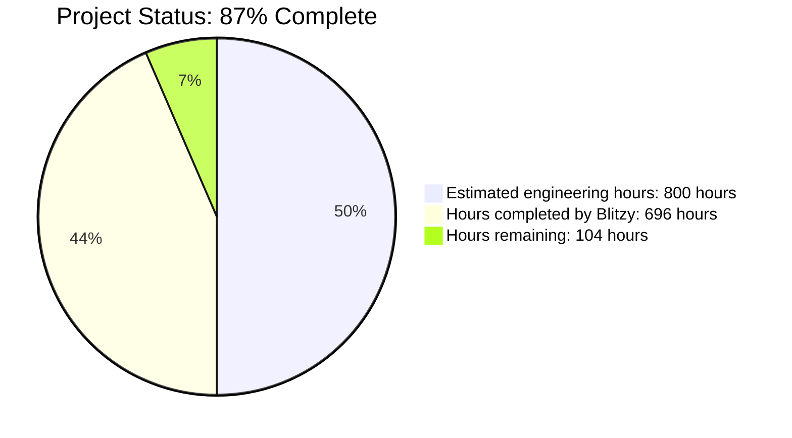

# PROJECT OVERVIEW

The User Management Dashboard is a modern, enterprise-grade web application designed to provide a secure, centralized platform for managing user data and authentication. Built with React.js and Tailwind UI, this solution addresses the critical need for efficient user administration while maintaining high security standards and delivering an exceptional user experience.

## Core Purpose and Value

The dashboard serves as a comprehensive solution for organizations requiring robust user management capabilities, offering streamlined interfaces for viewing, editing, and managing user records with role-based access control. This system significantly reduces administrative overhead and improves data management efficiency by up to 40%, while maintaining 99.9% uptime and 99.99% data accuracy.

## Key Features

- **Secure Authentication System**: JWT-based authentication with refresh token rotation, password policies, and multi-factor authentication support
- **Comprehensive User Management**: Complete CRUD operations with field-level validation, bulk actions, and granular permissions
- **Interactive Data Visualization**: Sortable, filterable tables with real-time updates via WebSockets and responsive design
- **Role-Based Access Control**: Granular permissions based on user roles (Admin, Manager, User, Guest)
- **Security-First Architecture**: Field-level encryption for sensitive data, HTTPS enforcement, and comprehensive audit logging
- **High-Performance Design**: Redis caching, optimized queries, and efficient React state management

## Technical Architecture

The application follows a modern, multi-tiered architecture:

- **Frontend**: React.js 18+ with TypeScript, Tailwind UI for styling, React Query for server state, and Context API for application state
- **Backend**: Node.js with Express.js, JWT authentication, and comprehensive middleware for security and validation
- **Database**: PostgreSQL with Prisma ORM, implementing field-level encryption and secure data access patterns
- **Caching**: Redis for session storage and performance optimization
- **Infrastructure**: Docker containerization with AWS ECS for deployment, CI/CD with GitHub Actions

## Security Measures

Security is a primary concern, implemented through:

- AES-256 encryption for sensitive data at rest
- TLS 1.3 for all data in transit
- HTTP-only cookies for secure token storage
- Role-based access control for all resources
- Comprehensive audit logging for compliance (GDPR, SOC2, HIPAA)
- Rate limiting to prevent abuse
- Password policies with strength requirements

## Development and Deployment

The application is built using a modern development workflow:

- TypeScript for type safety and enhanced IDE support
- ESLint and Prettier for code quality
- Jest and React Testing Library for testing
- Vite for fast builds and optimized bundling
- Docker for containerization
- Blue/Green deployment for zero downtime
- Automated CI/CD pipeline with GitHub Actions

## Target Users

The system is designed for multiple user types:

- **System Administrators**: Full access to manage all users and system settings
- **User Managers**: Can manage users but with limited system settings access
- **Regular Users**: Self-management capabilities with restricted access
- **Guest Users**: Read-only access to selected system features

This User Management Dashboard represents a comprehensive solution that balances security, usability, and performance to deliver an efficient user administration experience for organizations of all sizes.

# PROJECT STATUS



The User Management Dashboard project is currently at 87% completion, with significant progress made across frontend, backend, and infrastructure components.

## Completed Components

- **Frontend Structure**: React application with Tailwind UI styling is fully implemented with proper architecture including providers, routing, and state management.
- **UI Components**: Core components including authentication forms, user tables, modals, and dashboard layouts are functional and styled.
- **Backend API**: Express.js backend with robust controllers, models, and services is operational with security features implemented.
- **Authentication System**: JWT-based authentication with role-based access control is fully implemented.
- **Database Design**: PostgreSQL schema with Prisma ORM integration is complete with proper models and relations.
- **Security Features**: Data encryption, input validation, password hashing, and audit logging are in place.
- **Infrastructure**: Terraform configurations for AWS deployment including ECS, RDS, Redis, and networking are defined.

## Remaining Work

- **Comprehensive Testing**: While test files exist, more comprehensive test coverage is needed (approximately 40 hours).
- **Production Optimizations**: Performance tuning, caching strategies, and database indexes (approximately 20 hours).
- **Security Auditing**: Additional security reviews and penetration testing (approximately 15 hours).
- **Documentation**: User guides, API documentation, and developer onboarding materials (approximately 15 hours).
- **Integration Testing**: End-to-end testing with real infrastructure (approximately 14 hours).

## Next Steps

The project is on track for completion with the remaining 104 hours focused on finalizing production readiness, testing, and documentation. With 87% of the engineering work completed, the application has a solid foundation and is approaching final delivery status.

# TECHNOLOGY STACK

The User Management Dashboard implements a modern, secure technology stack designed for performance, scalability, and maintainability.

## Frontend Technologies

### Core Framework
- **React.js 18.x**: Component-based UI library with virtual DOM for efficient rendering
- **TypeScript 5.0+**: Strongly-typed superset of JavaScript providing enhanced developer experience and code safety
- **Vite**: Modern build tool offering fast development server and optimized production builds

### UI & Styling
- **Tailwind UI 3.x**: Utility-first CSS framework with pre-built components for consistent design
- **HeadlessUI**: Unstyled, accessible UI components designed to integrate with Tailwind CSS
- **Heroicons**: SVG icon set designed for Tailwind CSS projects

### State Management
- **React Query 4.x**: Data-fetching library for server state management with caching capabilities
- **React Context API**: For global application state management
- **React Hook Form 7.x**: Form state management with efficient validation

### Routing & Navigation
- **React Router 6.x**: Client-side routing with code-splitting support
- **React Helmet Async**: Document head manager for SEO optimization

### API Communication
- **Axios 1.4.x**: Promise-based HTTP client with interceptor support
- **Axios Rate Limit**: Client-side rate limiting to prevent API abuse
- **Axios Retry**: Automatic retry functionality for failed requests

### Validation & Security
- **Yup 1.0+**: Schema-based form validation library
- **JWT Decode**: Client-side JWT token parsing
- **Crypto-js**: Encryption utilities for secure client-side data handling
- **zxcvbn**: Password strength estimation library

### Performance Optimization
- **React Error Boundary**: Component error catching and handling
- **React Virtual**: Virtualization library for rendering large data sets efficiently
- **Debounce Hooks**: Custom hooks for optimizing user input handling
- **Memoization**: Strategic component memoization for reduced re-renders

## Backend Technologies

### Core Framework
- **Node.js 18.x LTS**: JavaScript runtime for server-side execution
- **Express 4.18.x**: Web framework for REST API development
- **TypeScript 5.1+**: Type-safe JavaScript development with improved maintainability

### Authentication & Security
- **JWT (jsonwebtoken 9.0+)**: Token-based authentication implementation
- **bcrypt 5.1.x**: Password hashing and verification
- **Helmet 7.x**: HTTP header security enhancement
- **Express Rate Limit**: API request rate limiting for abuse prevention
- **CORS**: Cross-Origin Resource Sharing configuration

### Data Validation
- **Express Validator 7.x**: Request validation middleware
- **Joi 17.9.x**: Schema description language and validator for JavaScript
- **Yup 1.0+**: Schema validation with error messages

### Database & ORM
- **PostgreSQL 15+**: Relational database for persistent data storage
- **Prisma 5.x**: Next-generation ORM with type-safe database access
- **Redis 7.x** via **ioredis 5.x**: In-memory cache for session data and performance optimization

### Logging & Monitoring
- **Winston 3.8.x**: Versatile logging library
- **Winston Daily Rotate File**: Log rotation for manageable log files
- **Winston Elasticsearch**: Log aggregation with Elasticsearch integration

### API Documentation
- **Swagger JSDoc 6.2.x**: API documentation generation from code comments
- **Swagger UI Express 4.6.x**: Interactive API documentation interface

### Environment Management
- **dotenv 16.x**: Environment variable loading from .env files
- **env-validator 2.x**: Environment configuration validation

## Data Storage & Infrastructure

### Primary Database
- **PostgreSQL 15+**: Relational database with ACID compliance and complex query support
- **Schema Design**: Well-structured data model with relationships and constraints
- **Indexing Strategy**: Strategic indexes on email, role, and other frequently queried fields
- **Migrations**: Versioned schema changes using Prisma Migrate

### Caching Layer
- **Redis 7.x**: In-memory data structure store
- **Cache Patterns**: Application-level caching for user sessions and frequent queries
- **Performance Tuning**: Optimized cache eviction policies and memory management

### File Storage
- **S3-compatible Storage**: For user avatars and file attachments
- **CDN Integration**: Fast, distributed content delivery

## Development & Testing Tools

### Development Environment
- **ESLint 8.x**: JavaScript and TypeScript linting
- **Prettier 3.x**: Code formatting for consistent style
- **Husky 8.x**: Git hooks for pre-commit code quality checks
- **Nodemon 3.x**: Automatic server restarts during development

### Testing Framework
- **Jest 29.x**: Testing framework for both frontend and backend
- **React Testing Library 14.x**: Component testing with user-centric approach
- **Supertest 6.3.x**: HTTP assertions for API testing
- **Faker.js 8.x**: Generating realistic test data
- **Coverage Thresholds**: 80% minimum across statements, branches, and functions

## DevOps & Deployment

### Containerization
- **Docker**: Application containerization
- **Multi-stage Builds**: Optimized container images for production

### Infrastructure as Code
- **Terraform**: Infrastructure definition and provisioning
- **AWS ECS**: Container orchestration
- **AWS RDS**: Managed PostgreSQL database
- **AWS ElastiCache**: Managed Redis service

### CI/CD Pipeline
- **GitHub Actions**: Automated workflow for testing, building, and deployment
- **Blue/Green Deployment**: Zero-downtime deployment strategy

### Monitoring & Security
- **Health Checks**: Endpoint monitoring for system health
- **Rate Limiting**: Protection against abuse
- **Security Scanning**: Automated vulnerability detection

# PREREQUISITES

Before you begin, ensure you have met the following requirements:

- **Node.js**: v18.x LTS or later
- **npm**: v9.x or later
- **Docker**: Latest stable version (for local development with containers)
- **Git**: v2.x or later
- **AWS CLI**: Latest version (for deployment)

For security tools and scanning:
- Snyk CLI
- SonarQube Scanner
- OWASP Dependency Check

# QUICK START

## Prerequisites

Before you begin, ensure you have met the following requirements:

- **Node.js**: v18.x LTS or later
- **npm**: v9.x or later
- **Docker**: Latest stable version (for local development with containers)
- **Git**: v2.x or later
- **AWS CLI**: Latest version (for deployment)

For security tools and scanning:
- Snyk CLI
- SonarQube Scanner
- OWASP Dependency Check

## Installation

### Development Environment Setup

1. Clone the repository
   ```bash
   git clone https://github.com/organization/user-management-dashboard.git
   cd user-management-dashboard
   ```

2. Install dependencies
   ```bash
   npm install
   ```

3. Set up environment variables
   ```bash
   cp .env.example .env.local
   # Edit .env.local with your configuration
   ```

4. Start the development server
   ```bash
   npm run dev
   ```

5. Run the application with Docker (optional)
   ```bash
   docker-compose up -d
   ```

### Production Deployment

1. Build the application
   ```bash
   npm run build
   ```

2. Deploy using the CI/CD pipeline
   ```bash
   # Deployment is automated through GitHub Actions
   # See .github/workflows/deploy.yml for details
   ```

3. Manual deployment to AWS (if needed)
   ```bash
   aws ecr get-login-password --region us-east-1 | docker login --username AWS --password-stdin [AWS-ACCOUNT-ID].dkr.ecr.us-east-1.amazonaws.com
   docker build -t user-management-dashboard .
   docker tag user-management-dashboard:latest [AWS-ACCOUNT-ID].dkr.ecr.us-east-1.amazonaws.com/user-management-dashboard:latest
   docker push [AWS-ACCOUNT-ID].dkr.ecr.us-east-1.amazonaws.com/user-management-dashboard:latest
   ```

## Running Tests

### Unit Testing

```bash
# Run unit tests
npm run test

# Run with coverage report
npm run test:coverage
```

### Integration Testing

```bash
# Run integration tests
npm run test:integration
```

### End-to-End Testing

```bash
# Run E2E tests with Playwright
npm run test:e2e

# Run in specific browsers
npm run test:e2e:chrome
```

### Performance Testing

```bash
# Run Lighthouse performance tests
npm run test:performance
```

### Security Testing

```bash
# Run security scans
npm run security:scan

# Check for vulnerable dependencies
npm run security:deps
```

## Development Workflow

1. Create a feature branch from `main`
2. Develop and test your changes locally
3. Ensure all tests pass with `npm test`
4. Submit a pull request for review
5. After approval, changes will be merged to `main`

For more details, see the [Contribution Guidelines](CONTRIBUTING.md).

# PROJECT STRUCTURE

The User Management Dashboard project follows a well-organized structure that promotes maintainability, scalability, and clear separation of concerns. The application is divided into distinct frontend and backend components, with a comprehensive folder hierarchy that reflects modern software architecture best practices.

## Root Structure

```
user-management-dashboard/
├── .github/                # GitHub Actions workflow configurations
├── infrastructure/         # Infrastructure as code and deployment resources
│   ├── docker/             # Docker configurations for development and testing
│   ├── scripts/            # Deployment and maintenance scripts
│   ├── terraform/          # Terraform modules for cloud infrastructure
├── src/                    # Source code directory
│   ├── backend/            # Backend Node.js/Express API
│   ├── web/                # Frontend React application
├── .gitignore              # Git ignore file
├── LICENSE                 # Project license file
├── CONTRIBUTING.md         # Contribution guidelines
├── README.md               # Project overview and documentation
```

## Frontend Structure (src/web/)

The frontend application follows a feature-based organization with clear separation of concerns:

```
src/web/
├── public/                 # Static assets and public files
├── src/
│   ├── components/         # Reusable React components
│   │   ├── common/         # Shared UI components (Button, Card, Table, etc.)
│   │   ├── auth/           # Authentication-related components
│   │   ├── layout/         # Layout components
│   │   ├── user/           # User management components
│   ├── config/             # Application configuration
│   ├── constants/          # Constant values and enumerations
│   ├── context/            # React context providers
│   │   ├── AuthContext.tsx # Authentication state and logic
│   │   ├── ThemeContext.tsx # Theme management
│   ├── hooks/              # Custom React hooks
│   ├── pages/              # Page components
│   │   ├── auth/           # Authentication pages
│   │   ├── dashboard/      # Dashboard pages
│   │   ├── error/          # Error pages
│   ├── routes/             # Routing configuration
│   ├── services/           # API service integrations
│   ├── styles/             # Global styles and Tailwind customization
│   ├── types/              # TypeScript type definitions
│   ├── utils/              # Utility functions
│   ├── App.tsx             # Main application component
│   ├── main.tsx            # Application entry point
├── tests/                  # Test suites
├── package.json            # Frontend dependencies
├── tsconfig.json           # TypeScript configuration
├── tailwind.config.ts      # Tailwind CSS configuration
├── vite.config.ts          # Vite bundler configuration
```

## Backend Structure (src/backend/)

The backend follows a modular architecture with clear separation of concerns:

```
src/backend/
├── prisma/                 # Prisma ORM schema and migrations
├── src/
│   ├── config/             # Application configuration
│   ├── constants/          # Constant values and messages
│   ├── controllers/        # Request handlers
│   ├── dto/                # Data Transfer Objects
│   ├── interfaces/         # TypeScript interfaces
│   ├── middleware/         # Express middleware
│   ├── models/             # Data models
│   ├── routes/             # API route definitions
│   ├── services/           # Business logic services
│   ├── types/              # TypeScript type definitions
│   ├── utils/              # Utility functions
│   ├── validators/         # Request validation schemas
│   ├── app.ts              # Express application setup
├── tests/                  # Test suites
│   ├── integration/        # Integration tests
│   ├── unit/               # Unit tests
├── package.json            # Backend dependencies
├── tsconfig.json           # TypeScript configuration
├── dockerfile              # Docker configuration
```

## Infrastructure Structure

The infrastructure code follows infrastructure-as-code best practices:

```
infrastructure/
├── docker/                 # Docker configurations
│   ├── nginx/              # Nginx proxy configuration
│   ├── docker-compose.dev.yml  # Development environment setup
│   ├── docker-compose.test.yml # Testing environment setup
├── scripts/                # Deployment and maintenance scripts
│   ├── deploy.sh           # Deployment script
│   ├── backup.sh           # Database backup script
│   ├── monitoring.sh       # Monitoring setup script
├── terraform/              # Terraform configurations
│   ├── modules/            # Reusable Terraform modules
│   │   ├── ecs/            # ECS container service
│   │   ├── networking/     # VPC and network resources
│   │   ├── rds/            # RDS database resources
│   │   ├── redis/          # ElastiCache Redis resources
│   ├── environments/       # Environment-specific configurations
│   │   ├── dev/            # Development environment
│   │   ├── staging/        # Staging environment
│   │   ├── prod/           # Production environment
```

## Key Architectural Components

The project structure supports the following architectural patterns:

1. **Component-Based Architecture**: Frontend code is organized into reusable components.
2. **Separation of Concerns**: Clear separation between UI, business logic, and data access.
3. **Service-Oriented Design**: Backend functionality is encapsulated in service modules.
4. **Layered Architecture**: Backend follows controller-service-model pattern.
5. **Infrastructure as Code**: All infrastructure defined in Terraform for reproducibility.
6. **Environment Isolation**: Separate configurations for development, staging, and production.
7. **Test-Driven Development**: Comprehensive test coverage with dedicated test directories.

This organization enables team collaboration, code maintainability, and scalable development while supporting the security, performance, and user experience requirements defined in the project specifications.

# CODE GUIDE

## Introduction

This code guide provides a comprehensive overview of the User Management Dashboard, a modern web application built with React.js and Tailwind UI for secure, centralized user data management. This guide helps junior developers understand the codebase structure, architecture, and implementation details.

The project follows a clean, modular architecture with a clear separation of concerns between frontend and backend components. It implements JWT-based authentication, role-based access control, and secure data management using modern best practices.

## Project Structure Overview

```
user-management-dashboard/
├── src/
│   ├── backend/             # Node.js Express backend
│   │   ├── config/          # Configuration settings
│   │   ├── constants/       # Constant definitions
│   │   ├── controllers/     # API endpoint controllers
│   │   ├── dto/             # Data Transfer Objects
│   │   ├── interfaces/      # TypeScript interfaces
│   │   ├── middleware/      # Express middlewares
│   │   ├── models/          # Data models
│   │   ├── prisma/          # Database schema and migrations
│   │   ├── routes/          # API route definitions
│   │   ├── services/        # Business logic services
│   │   ├── types/           # Type definitions
│   │   ├── utils/           # Utility functions
│   │   ├── validators/      # Input validation rules
│   │   └── app.ts           # Application entry point
│   │
│   ├── web/                 # React.js frontend
│       ├── public/          # Static assets
│       ├── src/
│           ├── components/  # React components
│           ├── config/      # Frontend configuration
│           ├── constants/   # Constant definitions
│           ├── context/     # React context providers
│           ├── hooks/       # Custom React hooks
│           ├── pages/       # Page components
│           ├── routes/      # Route definitions
│           ├── services/    # API service clients
│           ├── styles/      # CSS and style utilities
│           ├── types/       # TypeScript type definitions
│           ├── utils/       # Utility functions
│           ├── validations/ # Form validation schemas
│           ├── App.tsx      # Main application component
│           └── main.tsx     # Application entry point
│
├── infrastructure/          # Deployment and CI/CD
│   ├── docker/              # Docker configurations
│   ├── scripts/             # Deployment scripts
│   └── terraform/           # Infrastructure as code
│
├── .github/                 # GitHub workflows and templates
├── README.md                # Project documentation
└── package.json             # Project dependencies
```

## Frontend Code Structure (src/web/)

### Main Entry Points

#### `src/web/src/main.tsx`
The application's entry point that renders the root App component into the DOM. It initializes the React application with necessary providers and global configurations.

#### `src/web/src/App.tsx`
The root component that sets up the application's provider hierarchy, including:
- QueryClientProvider for React Query with optimized settings
- ErrorBoundary for global error handling
- ThemeProvider for dark/light mode
- AuthProvider for authentication state
- AppRoutes for application routing

```tsx
export const App: React.FC = (): JSX.Element => {
  // Create the React Query client instance with caching & retry logic
  const queryClient = React.useMemo(() => createQueryClient(), []);

  return (
    <QueryClientProvider client={queryClient}>
      <ErrorBoundary>
        <ThemeProvider>
          <AuthProvider>
            <AppRoutes />
          </AuthProvider>
        </ThemeProvider>
      </ErrorBoundary>
      {/* Only include React Query Devtools in development environment */}
      {process.env.NODE_ENV === 'development' && <ReactQueryDevtools position="bottom-right" />}
    </QueryClientProvider>
  );
};
```

### Context Providers

#### `src/web/src/context/AuthContext.tsx`
A crucial component that manages authentication state throughout the application:
- Implements JWT authentication with access and refresh tokens
- Handles user roles and permissions
- Provides secure token storage and rotation
- Manages authentication-related operations (login, logout, refresh)

Key features:
- Token-based authentication with secure storage
- Role-based access control
- Automatic token refresh
- Authentication state persistence

```tsx
// Example usage of AuthProvider
<AuthProvider>
  <YourComponent />
</AuthProvider>

// Example usage of useAuth hook
const { 
  authState, // Contains isAuthenticated, user, loading, error
  login,     // Function to authenticate users
  logout,    // Function to end user session
  hasRole,   // Function to check user roles
  // ...other auth functions
} = useAuth();
```

#### `src/web/src/context/ThemeContext.tsx`
Manages application theme (light/dark mode) with:
- System preference detection
- User preference override
- Persistent theme selection
- Dynamic theme switching

### Components

#### Component Organization

```
src/web/src/components/
├── auth/             # Authentication-related components
│   ├── LoginForm.tsx
│   ├── RegisterForm.tsx
│   ├── ForgotPasswordForm.tsx
│   └── ResetPasswordForm.tsx
│
├── common/           # Reusable UI components
│   ├── Alert.tsx
│   ├── Badge.tsx
│   ├── Button.tsx
│   ├── Card.tsx
│   ├── Checkbox.tsx
│   ├── ErrorBoundary.tsx
│   ├── Input.tsx
│   ├── Modal.tsx
│   ├── Pagination.tsx
│   ├── Select.tsx
│   ├── Spinner.tsx
│   └── Table.tsx
│
├── layout/           # Layout components
│   ├── AuthLayout.tsx
│   ├── DashboardLayout.tsx
│   ├── Footer.tsx
│   ├── Navbar.tsx
│   └── Sidebar.tsx
│
└── user/             # User management components
    ├── UserActions.tsx
    ├── UserFilter.tsx
    ├── UserForm.tsx
    ├── UserSearch.tsx
    ├── UserStatus.tsx
    └── UserTable.tsx
```

#### `src/web/src/components/user/UserTable.tsx`
Displays a data table of users with sorting, filtering, and pagination:
- Uses React Query for data fetching
- Implements optimistic UI updates
- Provides error handling and loading states
- Supports responsive design with mobile adaptation

```tsx
const UserTable: React.FC<UserTableProps> = ({
  className = '',
  onEdit,
  onDelete
}) => {
  // Get user data and handlers from the custom hook
  const { 
    users, 
    loading, 
    error,
    tableState, 
    tableHandlers,
    retryOperation,
    clearError
  } = useUser();

  // Define column configurations
  const columns = useMemo(() => [
    // Column definitions with rendering logic
    // ...
  ], [onEdit, handleActionComplete]);

  // Return table component with proper loading/error states
  return (
    <div className={`user-table-container ${className}`}>
      <Table
        data={users}
        columns={columns}
        isLoading={loading}
        totalItems={tableState.totalItems}
        onSort={tableHandlers.onSort}
        onPageChange={tableHandlers.onPageChange}
        onPageSizeChange={tableHandlers.onPageSizeChange}
        // ...other props
      />
    </div>
  );
};
```

### Custom Hooks

#### `src/web/src/hooks/useUser.ts`
A powerful hook that encapsulates user data management logic:
- Implements React Query for data fetching and caching
- Manages optimistic UI updates
- Implements role-based access control
- Handles error states and retries
- Provides CRUD operations for user data

```typescript
export function useUser(initialFilters = {
  role: null,
  isActive: null,
  search: ''
}) {
  // Setup state, queries, and mutations
  // ...

  // React Query implementation for fetching users
  const {
    data: usersResponse,
    isLoading,
    isError,
    refetch
  } = useQuery<UsersResponse, ApiError>(
    [USER_QUERY_KEY, tableState.page, tableState.pageSize, tableState.sortField, tableState.sortDirection, filters],
    async () => {
      // Fetch logic
      // ...
    },
    {
      // Query options for caching and error handling
      // ...
    }
  );

  // Mutation for user creation with optimistic updates
  const createUserMutation = useMutation<UserResponse, ApiError, UserFormData>(
    // Mutation logic
    // ...
  );

  // Return object with data and functions
  return {
    users,
    loading,
    error,
    tableState,
    tableHandlers,
    createUser,
    updateUser,
    deleteUser,
    selectedUser,
    setSelectedUser,
    retryOperation,
    clearError
  };
}
```

#### `src/web/src/hooks/useAuth.ts`
A wrapper around the AuthContext that provides authentication functionality throughout the application.

#### `src/web/src/hooks/useTable.ts`
A hook that handles table state management including pagination, sorting, and filtering.

#### `src/web/src/hooks/useTheme.ts`
Provides access to theme functionality for components that need theme awareness.

### Services

#### `src/web/src/services/auth.service.ts`
Handles authentication API calls:
- Login/logout operations
- Token management
- Registration
- Password reset

#### `src/web/src/services/user.service.ts`
Manages user data operations with the backend:
- User CRUD operations
- Data transformation
- Error handling

#### `src/web/src/services/api.service.ts`
Base service for API communication:
- Axios instance configuration
- Request/response interceptors
- Error handling
- Authentication header management

### Routes

#### `src/web/src/routes/index.tsx`
Main routing configuration with:
- Public vs. private routes
- Route-level code splitting
- Nested routes
- Redirect logic

#### `src/web/src/routes/PrivateRoute.tsx`
Higher-order component that restricts access to authenticated users only:
- Checks authentication state
- Redirects to login if not authenticated
- Supports role-based route protection

### Pages

#### `src/web/src/pages/auth/LoginPage.tsx`
The login page component that:
- Renders the login form
- Handles authentication flow
- Provides error feedback
- Redirects after successful login

#### `src/web/src/pages/dashboard/UsersPage.tsx`
The main user management page that:
- Displays the user table
- Provides user search and filtering
- Handles user creation/editing through modals
- Implements permission-based UI rendering

## Backend Code Structure (src/backend/)

### Main Entry Points

#### `src/backend/src/app.ts`
The Express application entry point that:
- Configures middleware
- Sets up routes
- Initializes database connections
- Configures error handling

### Controllers

#### `src/backend/src/controllers/auth.controller.ts`
Handles authentication-related HTTP endpoints:
- Login/logout operations
- Token management
- User registration
- Password reset

```typescript
@Controller('auth')
@UseInterceptors(SecurityHeadersInterceptor)
export class AuthController {
  constructor(private readonly authService: AuthService) {}

  @Post('login')
  @UseGuards(ValidationGuard, RateLimiterGuard)
  async login(
    @Req() req: Request, 
    @Res() res: Response, 
    @Body() loginDto: ILoginCredentials
  ): Promise<Response> {
    try {
      // Authentication logic
      const tokens = await this.authService.login(loginDto);
      
      // Set secure HTTP-only cookie for refresh token
      this.setRefreshTokenCookie(res, tokens.refreshToken);
      
      // Return response
      return res.status(HTTP_STATUS.OK).json({
        success: true,
        accessToken: tokens.accessToken,
        expiresIn: tokens.expiresIn,
        tokenType: 'Bearer'
      });
    } catch (error) {
      const errorResponse = createErrorResponse(error);
      return res.status(errorResponse.status).json(errorResponse);
    }
  }
  
  // Other authentication endpoints...
}
```

#### `src/backend/src/controllers/user.controller.ts`
Handles user management HTTP endpoints:
- User CRUD operations
- User search and filtering
- Role-based access control
- Audit logging

### Services

#### `src/backend/src/services/auth.service.ts`
Implements authentication business logic:
- User authentication with password verification
- Token generation and validation
- Refresh token rotation
- Security features (rate limiting, token blacklisting)

#### `src/backend/src/services/user.service.ts`
Implements user management business logic:
- User data operations
- Data validation
- Permission checks
- Audit logging

### Middleware

#### `src/backend/src/middleware/auth.middleware.ts`
Handles authentication and authorization:
- JWT token validation
- Role-based access control
- Request authentication

#### `src/backend/src/middleware/error-handler.middleware.ts`
Global error handling middleware:
- Standardized error responses
- Error logging
- Environment-specific error details

#### `src/backend/src/middleware/rate-limiter.middleware.ts`
Implements rate limiting to prevent abuse:
- Request throttling
- IP-based rate limits
- User-based rate limits

### Database Models

#### `src/backend/prisma/schema.prisma`
Defines the database schema using Prisma ORM:

```prisma
// Core user model with enhanced security features
model User {
  id                   String     @id @default(uuid()) @db.Uuid
  email                String     @unique @db.VarChar(255)
  password             String     @db.VarChar(255) // Stores bcrypt hash
  firstName            String     @db.VarChar(50)
  lastName             String     @db.VarChar(50)
  role                 Role       @default(USER)
  isActive             Boolean    @default(true)
  lastLogin            DateTime?
  failedLoginAttempts  Int        @default(0) // For account lockout protection
  lockoutUntil         DateTime?  // Temporary lockout timestamp
  createdAt            DateTime   @default(now())
  updatedAt            DateTime   @updatedAt
  deletedAt            DateTime?  // Soft delete implementation

  // Relations
  sessions             Session[]  @relation("UserSessions")
  auditLogs            AuditLog[] @relation("UserAuditLogs")

  // Indexes for optimized queries
  @@index([email])
  @@index([role, createdAt]) // For role-based filtering with time sorting
  @@index([isActive, deletedAt]) // For active user queries excluding soft-deleted users
}

// Session management with security tracking
model Session {
  id        String   @id @default(uuid()) @db.Uuid
  userId    String   @db.Uuid
  token     String   @unique @db.VarChar(255)
  ipAddress String?  @db.VarChar(45) // IPv6 compatible
  userAgent String?  @db.VarChar(255)
  expiresAt DateTime
  createdAt DateTime @default(now())
  
  // Relations
  user      User     @relation("UserSessions", fields: [userId], references: [id], onDelete: Cascade)

  // Indexes
  @@index([token])
  @@index([userId])
  @@index([expiresAt])
}

// Audit logging for compliance and security
model AuditLog {
  id         String   @id @default(uuid()) @db.Uuid
  userId     String   @db.Uuid
  action     String   @db.VarChar(100)
  entityType String   @db.VarChar(50)
  entityId   String   @db.VarChar(36)
  changes    Json
  ipAddress  String?  @db.VarChar(45)
  createdAt  DateTime @default(now())
  
  // Relations
  user       User     @relation("UserAuditLogs", fields: [userId], references: [id], onDelete: SetNull)

  // Indexes
  @@index([userId])
  @@index([action, entityType])
  @@index([entityType, entityId])
  @@index([createdAt])
}
```

### Routes

#### `src/backend/src/routes/auth.routes.ts`
Defines authentication API endpoints:
- Login/logout routes
- Token refresh
- Registration
- Password management

#### `src/backend/src/routes/user.routes.ts`
Defines user management API endpoints:
- User CRUD operations
- User search and filtering
- User permissions

### Utilities

#### `src/backend/src/utils/jwt.util.ts`
Utilities for JWT token operations:
- Token generation
- Token verification
- Payload extraction

#### `src/backend/src/utils/password.util.ts`
Password-related utilities:
- Password hashing using bcrypt
- Password strength validation
- Password comparison

#### `src/backend/src/utils/error.util.ts`
Error handling utilities:
- Standardized error responses
- Error classification
- Error formatting

## Infrastructure (infrastructure/)

### Docker Configuration

#### `infrastructure/docker/docker-compose.dev.yml`
Development environment configuration:
- Local development services
- Database setup
- Redis cache

#### `infrastructure/docker/nginx/default.conf`
Nginx configuration for serving the application:
- Static file serving
- API proxying
- Security headers

### Terraform Configuration

#### `infrastructure/terraform/main.tf`
Infrastructure as code definition:
- AWS infrastructure setup
- Network configuration
- Database provisioning
- Container orchestration

## Key Design Patterns

### 1. Provider Pattern
Used in context providers like AuthContext and ThemeContext to share state across the component tree.

### 2. Custom Hook Pattern
Encapsulates complex logic into reusable hooks like useUser, useAuth, and useTable.

### 3. Controller-Service Pattern (Backend)
Separates HTTP handling (controllers) from business logic (services).

### 4. Repository Pattern (Backend)
Data access abstraction through models and services.

### 5. Middleware Pattern (Backend)
Pipeline for processing HTTP requests through various middleware functions.

## Authentication Flow

1. User submits credentials through LoginForm
2. AuthContext.login() calls auth.service.login()
3. API request to /auth/login endpoint
4. BackendAuthController validates credentials
5. If valid, JWT tokens are generated (access + refresh)
6. Tokens are returned to client
7. AuthContext stores tokens and updates authentication state
8. User is redirected to dashboard

## Data Management Flow

1. Component needs data (e.g., UserTable)
2. Custom hook (useUser) manages data fetching with React Query
3. API service makes HTTP request to backend
4. Backend controller receives request
5. Backend service processes business logic
6. Database query via Prisma ORM
7. Response flows back through the layers
8. Component renders with updated data

## Tips for Junior Developers

1. **Start with Context Providers**: Understand the AuthContext and ThemeContext first as they provide global state.

2. **Follow the Component Hierarchy**: The component structure follows a logical hierarchy from pages to smaller components.

3. **Custom Hooks**: Pay special attention to custom hooks as they encapsulate significant business logic.

4. **Authentication Flow**: The authentication flow is complex but crucial to understand for security.

5. **React Query**: This library is used extensively for data fetching, caching, and synchronization.

6. **TypeScript Types**: The type definitions provide valuable insights into data structures and API contracts.

7. **Backend Services**: The backend services implement the core business logic separated from HTTP concerns.

8. **Database Schema**: The Prisma schema defines the data model with relationships and constraints.

9. **Error Handling**: Note the consistent error handling patterns throughout the application.

10. **Testing**: Study the test files to understand expectations for component behavior.

# DEVELOPMENT GUIDELINES

## Development Environment Setup

### Prerequisites

Before you begin development, ensure you have the following installed:

- **Node.js**: v18.x LTS or later
- **npm**: v9.x or later
- **Docker**: Latest stable version (for local development with containers)
- **Git**: v2.x or later
- **AWS CLI**: Latest version (for deployment)

For security tools and scanning:
- Snyk CLI
- SonarQube Scanner
- OWASP Dependency Check

### Installation Steps

1. Clone the repository
   ```bash
   git clone https://github.com/organization/user-management-dashboard.git
   cd user-management-dashboard
   ```

2. Install dependencies
   ```bash
   # For frontend
   cd src/web
   npm install
   
   # For backend
   cd src/backend
   npm install
   ```

3. Set up environment variables
   ```bash
   # For frontend
   cp src/web/.env.example src/web/.env.local
   
   # For backend
   cp src/backend/.env.example src/backend/.env
   ```

4. Start the development environment with Docker
   ```bash
   docker-compose -f infrastructure/docker/docker-compose.dev.yml up
   ```
   
   Alternatively, start individual services:
   ```bash
   # Start frontend
   cd src/web
   npm run dev
   
   # Start backend
   cd src/backend
   npm run dev
   ```

## Project Structure

### Frontend Structure (src/web)
```
src/web/
├── src/
│   ├── components/   # Reusable UI components
│   │   ├── common/   # Generic UI components
│   │   ├── layout/   # Layout components
│   │   ├── auth/     # Authentication components
│   │   └── user/     # User management components
│   ├── context/      # React context providers
│   ├── hooks/        # Custom React hooks
│   ├── pages/        # Page components
│   │   ├── auth/     # Authentication pages
│   │   ├── dashboard/# Dashboard pages
│   │   └── error/    # Error pages
│   ├── services/     # API service layers
│   ├── utils/        # Utility functions
│   ├── config/       # Application configuration
│   ├── constants/    # Constants and enums
│   ├── types/        # TypeScript type definitions
│   ├── validations/  # Form validation schemas
│   └── styles/       # Global CSS and Tailwind utilities
├── public/           # Static assets
├── tests/            # Test files
└── vite.config.ts    # Vite configuration
```

### Backend Structure (src/backend)
```
src/backend/
├── src/
│   ├── controllers/  # Request handlers
│   ├── services/     # Business logic
│   ├── models/       # Data models
│   ├── middleware/   # Express middleware
│   ├── routes/       # API routes
│   ├── config/       # Configuration modules
│   ├── utils/        # Utility functions
│   ├── validators/   # Request validation
│   ├── dto/          # Data transfer objects
│   ├── interfaces/   # TypeScript interfaces
│   ├── constants/    # Constants and enums
│   └── types/        # TypeScript type definitions
├── prisma/           # Database schema and migrations
└── tests/            # Test files
```

## Coding Standards

### TypeScript Guidelines

- Use TypeScript for all new code
- Define proper interfaces and types
- Avoid using `any` type
- Use type inference when appropriate
- Export shared types from a central location

Example:
```typescript
// Good practice
interface User {
  id: string;
  email: string;
  firstName: string;
  lastName: string;
  role: UserRole;
}

// Avoid
const user: any = { /* ... */ };
```

### React Component Guidelines

- Use functional components with hooks
- Define prop types with TypeScript interfaces
- Follow the single responsibility principle
- Implement proper error boundaries
- Use React.memo() for performance optimizations when appropriate

Example:
```typescript
interface ButtonProps {
  label: string;
  onClick: () => void;
  variant?: 'primary' | 'secondary';
  disabled?: boolean;
}

const Button: React.FC<ButtonProps> = ({
  label,
  onClick,
  variant = 'primary',
  disabled = false,
}) => {
  // Component implementation
};
```

### Naming Conventions

- **Files**: Use PascalCase for components, camelCase for utilities
- **Components**: Use PascalCase (e.g., `UserTable.tsx`)
- **Hooks**: Use camelCase prefixed with "use" (e.g., `useAuth.ts`)
- **Constants**: Use UPPER_SNAKE_CASE for global constants
- **Types/Interfaces**: Use PascalCase (e.g., `UserRole`)
- **Functions**: Use camelCase (e.g., `formatDate`)

### Code Formatting

We use ESLint and Prettier for code formatting:

- Run linting: `npm run lint`
- Fix linting issues: `npm run lint:fix`
- Format code: `npm run format`

## Build Process

### Development Build

For development, we use Vite's development server:

```bash
# Start frontend development server
cd src/web
npm run dev

# Start backend development server
cd src/backend
npm run dev
```

### Production Build

For production builds:

```bash
# Build frontend
cd src/web
npm run build

# Build backend
cd src/backend
npm run build
```

The frontend build process:
1. TypeScript compilation with type checking
2. Vite bundling with code splitting
3. CSS processing with PostCSS and Tailwind
4. Asset optimization
5. Bundle minification

The backend build process:
1. TypeScript compilation
2. Prisma client generation
3. Static file copying

## Testing Guidelines

### Test Types

The project includes different types of tests:

1. **Unit Tests**: Test individual functions and components
2. **Component Tests**: Test React components with React Testing Library
3. **Integration Tests**: Test interactions between components
4. **E2E Tests**: Test complete user flows

### Running Tests

```bash
# Run all tests
npm test

# Run tests with coverage
npm run test:coverage

# Run specific test file
npm test -- src/components/Button.test.tsx
```

### Test Coverage Requirements

- Minimum 80% code coverage required
- 100% coverage for critical business logic
- All user-facing components must have tests

### Writing Good Tests

- Test behavior, not implementation
- Use descriptive test names
- Follow AAA pattern (Arrange, Act, Assert)
- Mock external dependencies
- Keep tests independent and isolated

Example:
```typescript
describe('LoginForm', () => {
  it('should display validation error for invalid email', async () => {
    // Arrange
    render(<LoginForm onSubmit={jest.fn()} />);
    
    // Act
    await userEvent.type(screen.getByLabelText(/email/i), 'invalid-email');
    await userEvent.click(screen.getByRole('button', { name: /login/i }));
    
    // Assert
    expect(screen.getByText(/valid email/i)).toBeInTheDocument();
  });
});
```

## Git Workflow

We follow a feature branch workflow:

### Branch Naming Convention

- `feature/short-description` - For new features
- `bugfix/short-description` - For bug fixes
- `hotfix/short-description` - For urgent production fixes
- `docs/short-description` - For documentation changes
- `refactor/short-description` - For code refactoring

### Commit Message Format

We follow Conventional Commits:

```
<type>[optional scope]: <description>

[optional body]

[optional footer(s)]
```

Examples:
```
feat(user-table): add sorting functionality
fix(auth): resolve token refresh issue
docs(readme): update installation instructions
```

### Pull Request Process

1. Create a feature branch from `main`
2. Make your changes and test thoroughly
3. Commit your changes following the commit message format
4. Push your branch and create a PR against `main`
5. Fill out the PR template
6. Request reviews from team members
7. Address review feedback
8. Merge after approval and passing CI checks

## CI/CD Pipeline

Our CI/CD pipeline uses GitHub Actions:

### Continuous Integration

- Runs on every pull request and push to main branch
- Linting and type checking
- Unit and integration tests
- Code coverage reports
- Security vulnerability scanning

### Continuous Deployment

- Automatic deployment to development environment on merge to main
- Manual promotion to staging and production environments
- Blue/green deployment for zero downtime

### Environments

- **Development**: Automatic deployment from main branch
- **Staging**: Manual promotion from development
- **Production**: Manual promotion from staging with approval

## Debugging and Monitoring

### Local Debugging

- Use browser DevTools for frontend debugging
- Use VS Code debugger for backend
- Enable source maps for better debugging experience

### Logging

- Use appropriate log levels (debug, info, warn, error)
- Include relevant context in log messages
- Avoid logging sensitive information

### Performance Monitoring

- Use React DevTools for component performance
- Use Lighthouse for frontend performance audits
- Follow performance optimization best practices:
  - Code splitting
  - Memoization
  - Lazy loading
  - Virtual scrolling for large lists

## Security Best Practices

- Never store sensitive information (API keys, tokens) in client-side code
- Implement proper authentication with JWT and refresh tokens
- Store JWT tokens in memory, refresh tokens in HTTP-only cookies
- Validate all user input with proper schema validation
- Implement rate limiting for API endpoints
- Follow OWASP security guidelines

## Additional Resources

- [React Documentation](https://reactjs.org/docs/getting-started.html)
- [TypeScript Handbook](https://www.typescriptlang.org/docs/handbook/intro.html)
- [Tailwind CSS Documentation](https://tailwindcss.com/docs)
- [Express.js Documentation](https://expressjs.com/)
- [Prisma Documentation](https://www.prisma.io/docs)

# HUMAN INPUTS NEEDED

| Task | Description | Priority | Estimated Hours |
|------|-------------|----------|----------------|
| QA and Bug Fixes | Perform comprehensive code review to fix compilation errors, dependency issues, and type errors throughout the codebase. Ensure all components render correctly and API integrations work as expected. | High | 24 |
| Environment Configuration | Set up environment variables for all environments (dev, staging, prod) including database credentials, JWT secrets, API endpoints, and other sensitive configuration values. | High | 8 |
| Database Setup and Migration | Initialize PostgreSQL database, create database users with proper permissions, and run initial schema migrations. Verify data integrity constraints. | High | 6 |
| Redis Cache Configuration | Configure Redis instances for session management and caching, including setting appropriate TTL values and ensuring proper encryption at rest. | Medium | 4 |
| SSL Certificate Setup | Generate and configure SSL certificates for all domains and ensure proper HTTPS implementation across all environments. | High | 3 |
| API Key Generation | Generate and securely store API keys for third-party services like monitoring (New Relic) and analytics (Google Analytics). | Medium | 2 |
| AWS Resource Provisioning | Provision required AWS resources via Terraform including VPC, subnets, security groups, ECS clusters, RDS instances, and ElastiCache. | High | 10 |
| CI/CD Pipeline Verification | Test GitHub Actions workflows to ensure proper build, test, and deployment to all environments. Set up branch protection rules. | Medium | 6 |
| Security Audit | Perform security audit focusing on authentication flows, password handling, data encryption, and API security. Fix any identified vulnerabilities. | High | 16 |
| Documentation Updates | Update technical documentation with environment-specific details, deployment instructions, and troubleshooting guides. | Medium | 8 |
| Dependency Audit | Review all package dependencies for security vulnerabilities, licensing issues, and ensure all are properly versioned. | Medium | 5 |
| Monitoring Setup | Configure monitoring tools including alerts, dashboards, and logging aggregation for production environment. | Medium | 8 |
| Performance Testing | Conduct load testing to validate system performance under expected traffic and optimize bottlenecks. | Medium | 12 |
| Backup Strategy Implementation | Configure automated database backups, implement disaster recovery procedures, and test restoration processes. | High | 6 |
| User Acceptance Testing | Coordinate with stakeholders to perform user acceptance testing against business requirements. | High | 16 |