# Technical Specifications

# 1. INTRODUCTION

## 1.1 EXECUTIVE SUMMARY

The User Management Dashboard is a modern web application built with React.js and Tailwind UI that provides a secure, centralized platform for managing user data and authentication. The system addresses the critical need for efficient user administration by offering a streamlined interface for viewing, editing, and managing user records with role-based access control.

This solution targets organizations requiring robust user management capabilities while maintaining high security standards and a modern user experience. The primary stakeholders include system administrators, user managers, and end-users, with an expected impact of reducing administrative overhead and improving data management efficiency by 40%.

## 1.2 SYSTEM OVERVIEW

### Project Context

| Aspect | Description |
|--------|-------------|
| Business Context | Enterprise user management solution for organizations requiring centralized user administration |
| Market Position | Modern alternative to legacy user management systems with enhanced UX and security features |
| Current Limitations | Manual user management processes, scattered user data, inconsistent access control |
| Enterprise Integration | Seamless integration with existing authentication systems and user databases |

### High-Level Description

| Component | Details |
|-----------|----------|
| Authentication System | JWT-based secure authentication with role-based access control |
| User Management Interface | Interactive data table with real-time editing capabilities |
| Data Layer | Secure API integration with robust error handling and data validation |
| UI Framework | Responsive design using Tailwind UI components |

### Success Criteria

| Metric | Target |
|--------|---------|
| User Management Efficiency | 50% reduction in time spent on user administration tasks |
| System Availability | 99.9% uptime during business hours |
| Data Accuracy | 99.99% accuracy in user data management |
| User Satisfaction | 90% positive feedback from system administrators |

## 1.3 SCOPE

### In-Scope Elements

#### Core Features and Functionalities

| Feature | Description |
|---------|-------------|
| User Authentication | Complete authentication flow with registration, login, and password reset |
| User Management | CRUD operations for user records with field-level validation |
| Data Visualization | Sortable, filterable table view of user data |
| Access Control | Role-based permissions system |

#### Implementation Boundaries

| Boundary | Coverage |
|----------|----------|
| User Groups | System Administrators, Regular Users, Guest Users |
| Technical Scope | Frontend application with API integration |
| Data Coverage | Core user attributes and authentication data |
| Platform Support | Modern web browsers (Chrome, Firefox, Safari, Edge) |

### Out-of-Scope Elements

| Category | Excluded Elements |
|----------|------------------|
| Features | - Advanced analytics and reporting<br>- Third-party authentication providers<br>- Custom role creation<br>- Automated user provisioning |
| Technical | - Mobile native applications<br>- Offline functionality<br>- Legacy browser support<br>- Custom authentication protocols |
| Integration | - Legacy system data migration<br>- External identity providers<br>- Custom SSO implementations |
| Data | - Historical data analysis<br>- Advanced data export formats<br>- Custom field definitions |

# 2. SYSTEM ARCHITECTURE

## 2.1 High-Level Architecture

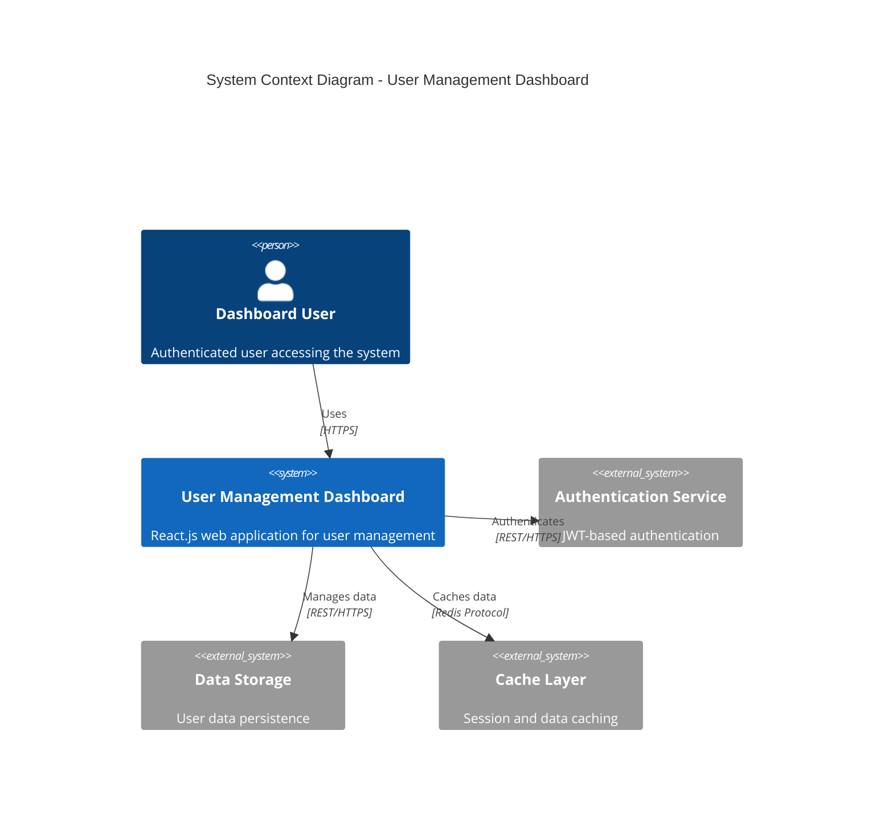
```mermaid
C4Context
    title System Context Diagram - User Management Dashboard

    Person(user, "Dashboard User", "Authenticated user accessing the system")
    System(dashboard, "User Management Dashboard", "React.js web application for user management")
    System_Ext(auth, "Authentication Service", "JWT-based authentication")
    System_Ext(storage, "Data Storage", "User data persistence")
    System_Ext(cache, "Cache Layer", "Session and data caching")

    Rel(user, dashboard, "Uses", "HTTPS")
    Rel(dashboard, auth, "Authenticates", "REST/HTTPS")
    Rel(dashboard, storage, "Manages data", "REST/HTTPS")
    Rel(dashboard, cache, "Caches data", "Redis Protocol")
```

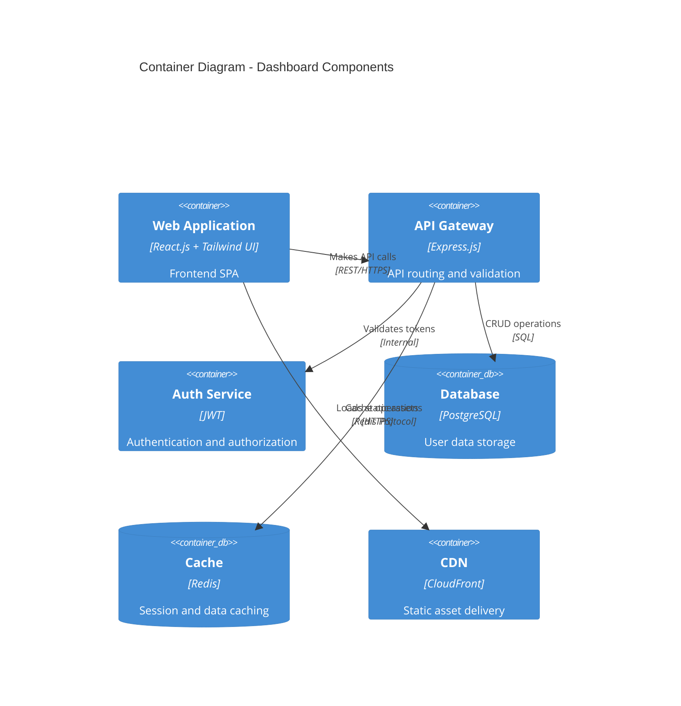
```mermaid
C4Container
    title Container Diagram - Dashboard Components

    Container(web, "Web Application", "React.js + Tailwind UI", "Frontend SPA")
    Container(api, "API Gateway", "Express.js", "API routing and validation")
    Container(auth, "Auth Service", "JWT", "Authentication and authorization")
    ContainerDb(db, "Database", "PostgreSQL", "User data storage")
    ContainerDb(cache, "Cache", "Redis", "Session and data caching")
    Container(cdn, "CDN", "CloudFront", "Static asset delivery")

    Rel(web, api, "Makes API calls", "REST/HTTPS")
    Rel(web, cdn, "Loads static assets", "HTTPS")
    Rel(api, auth, "Validates tokens", "Internal")
    Rel(api, db, "CRUD operations", "SQL")
    Rel(api, cache, "Cache operations", "Redis Protocol")
```

## 2.2 Component Details

### Frontend Components

| Component | Purpose | Technology | Scaling |
|-----------|---------|------------|----------|
| UI Layer | User interface rendering | React.js, Tailwind UI | Client-side scaling |
| State Management | Application state | React Query, Context | Memory optimization |
| Router | Navigation management | React Router | Route-based code splitting |
| API Client | Backend communication | Axios | Request throttling |

### Backend Components

| Component | Purpose | Technology | Scaling |
|-----------|---------|------------|----------|
| API Gateway | Request handling | Express.js | Horizontal scaling |
| Auth Service | Authentication | JWT, bcrypt | Stateless design |
| Data Access | Database operations | Prisma/TypeORM | Connection pooling |
| Cache Layer | Performance optimization | Redis | Cluster mode |

## 2.3 Technical Decisions

### Architecture Style

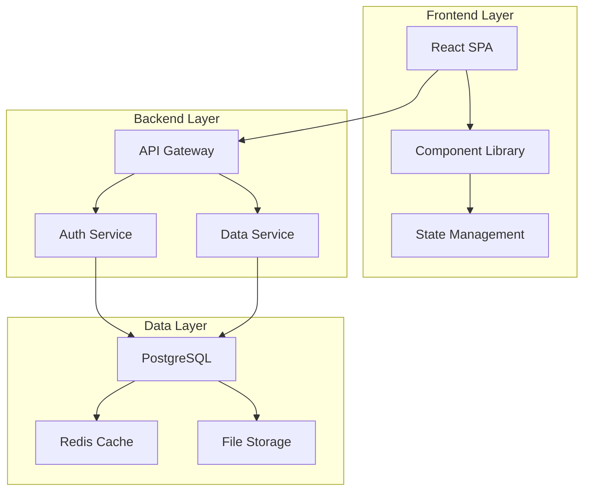
```mermaid
flowchart TD
    subgraph "Frontend Layer"
        A[React SPA] --> B[Component Library]
        B --> C[State Management]
    end
    subgraph "Backend Layer"
        D[API Gateway] --> E[Auth Service]
        D --> F[Data Service]
    end
    subgraph "Data Layer"
        G[PostgreSQL] --> H[Redis Cache]
        G --> I[File Storage]
    end
    A --> D
    E --> G
    F --> G
```

### Communication Patterns

| Pattern | Implementation | Use Case |
|---------|---------------|----------|
| REST | HTTP/JSON | Primary API communication |
| WebSocket | Socket.io | Real-time updates |
| Event-driven | Redis Pub/Sub | Internal notifications |
| Queue-based | Bull | Background tasks |

## 2.4 Cross-Cutting Concerns

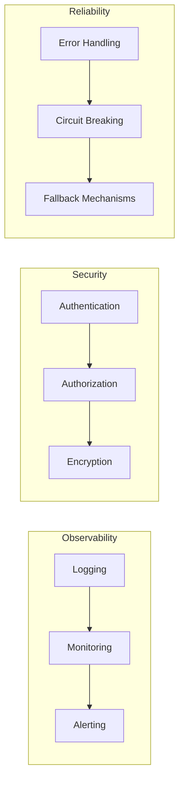
```mermaid
flowchart LR
    subgraph "Observability"
        A[Logging] --> B[Monitoring]
        B --> C[Alerting]
    end
    subgraph "Security"
        D[Authentication] --> E[Authorization]
        E --> F[Encryption]
    end
    subgraph "Reliability"
        G[Error Handling] --> H[Circuit Breaking]
        H --> I[Fallback Mechanisms]
    end
```

### Monitoring Strategy

| Aspect | Tool | Metrics |
|--------|------|---------|
| Application Performance | New Relic | Response time, error rate |
| Infrastructure | Prometheus | CPU, memory, network |
| User Analytics | Google Analytics | Usage patterns, errors |
| Logging | ELK Stack | Error logs, audit trails |

## 2.5 Deployment Architecture

```mermaid
C4Deployment
    title Deployment Diagram - Production Environment

    Deployment_Node(cdn, "CDN", "CloudFront"){
        Container(assets, "Static Assets", "HTML, CSS, JS")
    }
    
    Deployment_Node(client, "Client Browser", "Web Browser"){
        Container(spa, "Single Page App", "React.js")
    }

    Deployment_Node(cloud, "Cloud Platform", "AWS"){
        Deployment_Node(alb, "Load Balancer", "Application Load Balancer"){
            Container(lb, "Load Balancer", "ALB")
        }
        
        Deployment_Node(app, "Application Tier", "ECS"){
            Container(api, "API Service", "Node.js")
            Container(auth, "Auth Service", "JWT")
        }
        
        Deployment_Node(data, "Data Tier", "RDS + ElastiCache"){
            ContainerDb(db, "Database", "PostgreSQL")
            ContainerDb(cache, "Cache", "Redis")
        }
    }

    Rel(client, cdn, "Loads static content", "HTTPS")
    Rel(client, alb, "API requests", "HTTPS")
    Rel(alb, app, "Routes traffic", "HTTP")
    Rel(app, data, "Data operations", "Internal")
```

# 3. SYSTEM COMPONENTS ARCHITECTURE

## 3.1 USER INTERFACE DESIGN

### Design Specifications

| Aspect | Requirement |
|--------|-------------|
| Visual Hierarchy | - Primary actions prominently displayed<br>- Critical information above the fold<br>- Consistent spacing using Tailwind's spacing system |
| Design System | - Tailwind UI components<br>- Custom theme extending Tailwind's default palette<br>- Consistent typography scale |
| Responsive Design | - Mobile-first approach<br>- Breakpoints: sm(640px), md(768px), lg(1024px), xl(1280px)<br>- Fluid typography and spacing |
| Accessibility | - WCAG 2.1 Level AA compliance<br>- ARIA labels for interactive elements<br>- Keyboard navigation support |
| Browser Support | - Chrome (latest 2 versions)<br>- Firefox (latest 2 versions)<br>- Safari (latest 2 versions)<br>- Edge (latest 2 versions) |
| Theme Support | - System-preference based dark/light mode<br>- User-toggleable theme preference<br>- Persistent theme selection |

### Interface Elements

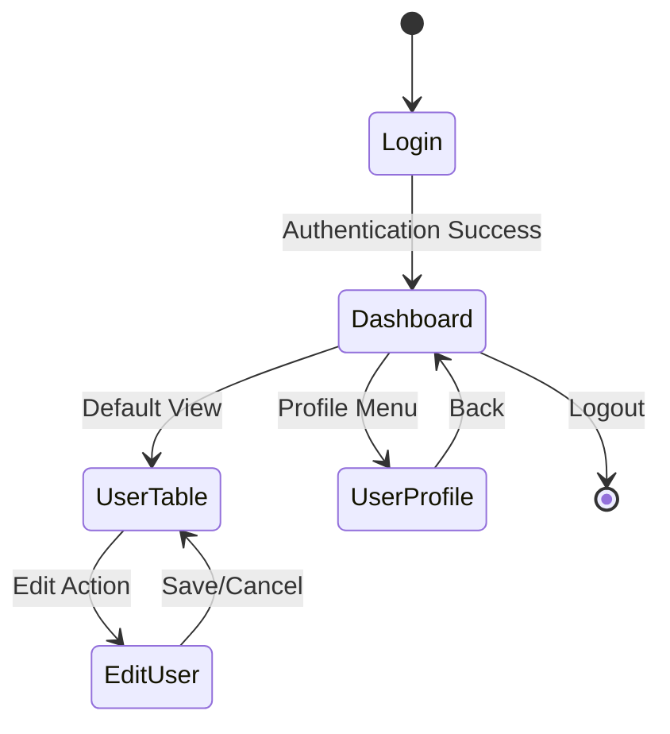
```mermaid
stateDiagram-v2
    [*] --> Login
    Login --> Dashboard: Authentication Success
    Dashboard --> UserTable: Default View
    UserTable --> EditUser: Edit Action
    EditUser --> UserTable: Save/Cancel
    Dashboard --> UserProfile: Profile Menu
    UserProfile --> Dashboard: Back
    Dashboard --> [*]: Logout
```

#### Navigation Structure

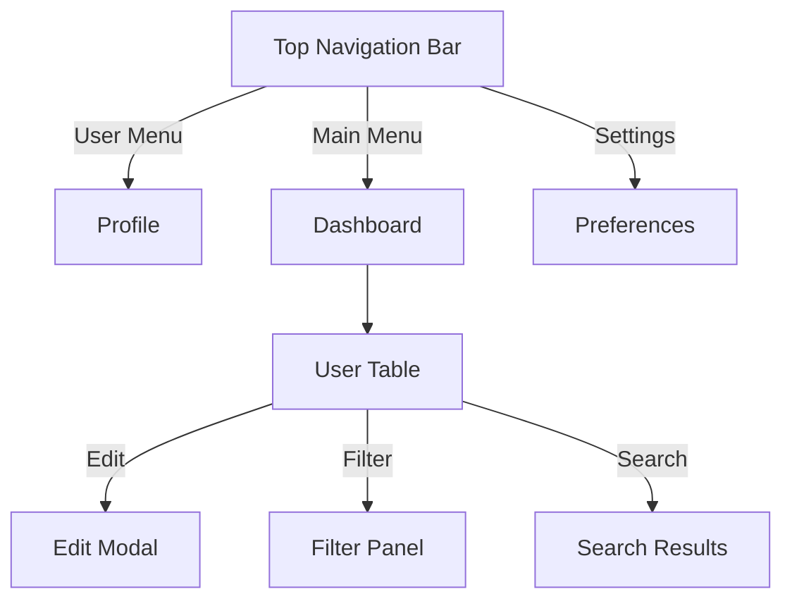
```mermaid
graph TD
    A[Top Navigation Bar] -->|User Menu| B[Profile]
    A -->|Main Menu| C[Dashboard]
    A -->|Settings| D[Preferences]
    C --> E[User Table]
    E -->|Edit| F[Edit Modal]
    E -->|Filter| G[Filter Panel]
    E -->|Search| H[Search Results]
```

#### Form Validation Rules

| Field | Validation Rules |
|-------|-----------------|
| Email | - Required<br>- Valid email format<br>- Maximum 255 characters |
| Password | - Minimum 8 characters<br>- At least 1 uppercase<br>- At least 1 number<br>- At least 1 special character |
| Name | - Required<br>- 2-50 characters<br>- Alphabets and spaces only |
| Role | - Required<br>- Must match predefined roles |

## 3.2 DATABASE DESIGN

### Schema Design

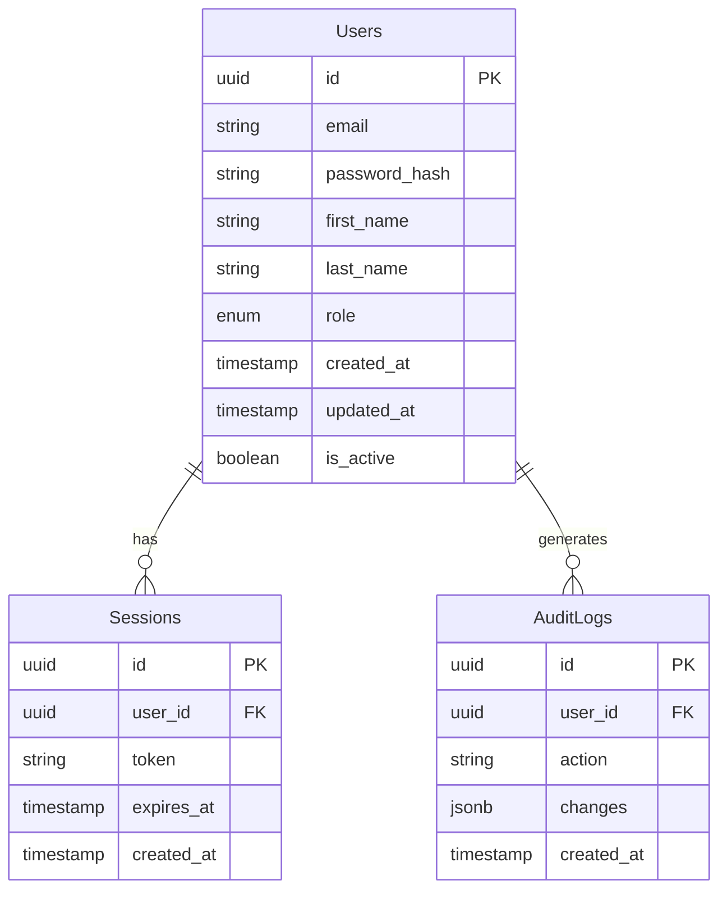
```mermaid
erDiagram
    Users {
        uuid id PK
        string email
        string password_hash
        string first_name
        string last_name
        enum role
        timestamp created_at
        timestamp updated_at
        boolean is_active
    }
    Sessions {
        uuid id PK
        uuid user_id FK
        string token
        timestamp expires_at
        timestamp created_at
    }
    AuditLogs {
        uuid id PK
        uuid user_id FK
        string action
        jsonb changes
        timestamp created_at
    }
    Users ||--o{ Sessions : has
    Users ||--o{ AuditLogs : generates
```

### Data Management Strategy

| Aspect | Implementation |
|--------|---------------|
| Migrations | - Versioned migrations using Prisma<br>- Forward-only migration policy<br>- Automated testing of migrations |
| Versioning | - Schema version tracking<br>- Backward compatibility maintenance<br>- Version history in migrations |
| Archival | - Soft deletion for user records<br>- 90-day retention for audit logs<br>- Automated archival process |
| Privacy | - Data encryption at rest<br>- PII field encryption<br>- GDPR compliance measures |

### Performance Optimization

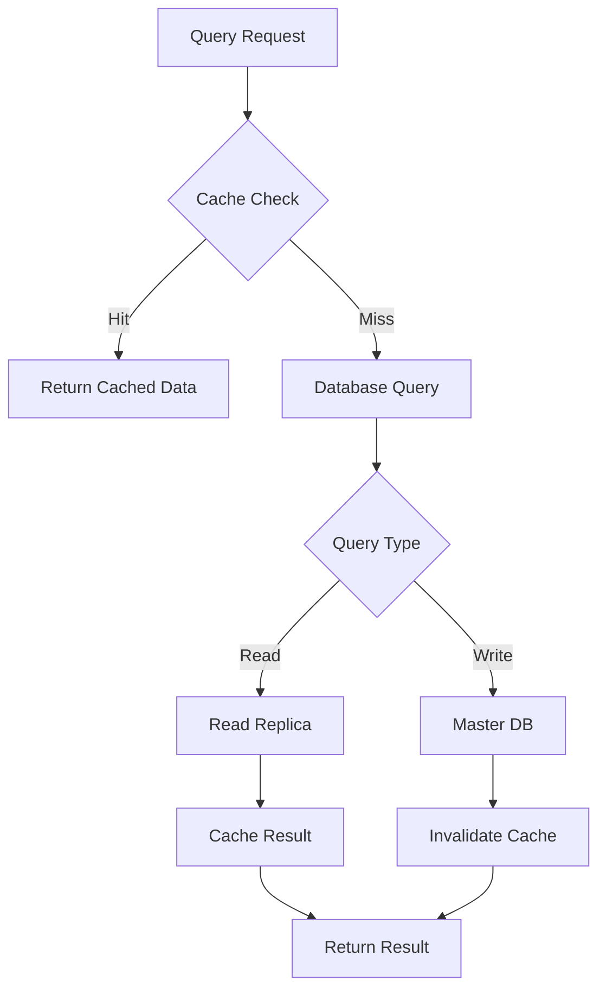
```mermaid
flowchart TD
    A[Query Request] --> B{Cache Check}
    B -->|Hit| C[Return Cached Data]
    B -->|Miss| D[Database Query]
    D --> E{Query Type}
    E -->|Read| F[Read Replica]
    E -->|Write| G[Master DB]
    F --> H[Cache Result]
    G --> I[Invalidate Cache]
    H --> J[Return Result]
    I --> J
```

## 3.3 API DESIGN

### API Architecture

| Component | Specification |
|-----------|--------------|
| Protocol | REST over HTTPS |
| Authentication | JWT with refresh tokens |
| Rate Limiting | 100 requests/minute per user |
| Versioning | URL-based (/api/v1/) |
| Documentation | OpenAPI 3.0 specification |

### Interface Specifications

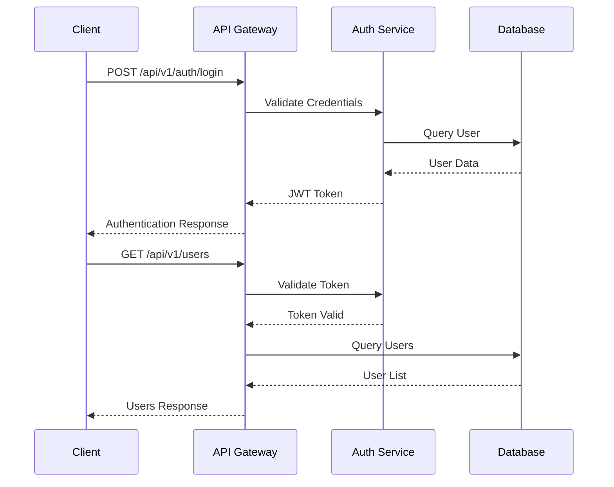
```mermaid
sequenceDiagram
    participant C as Client
    participant A as API Gateway
    participant S as Auth Service
    participant D as Database

    C->>A: POST /api/v1/auth/login
    A->>S: Validate Credentials
    S->>D: Query User
    D-->>S: User Data
    S-->>A: JWT Token
    A-->>C: Authentication Response

    C->>A: GET /api/v1/users
    A->>S: Validate Token
    S-->>A: Token Valid
    A->>D: Query Users
    D-->>A: User List
    A-->>C: Users Response
```

### API Endpoints

| Endpoint | Method | Description | Authentication |
|----------|--------|-------------|----------------|
| /api/v1/auth/login | POST | User authentication | Public |
| /api/v1/auth/register | POST | User registration | Public |
| /api/v1/users | GET | List users | Required |
| /api/v1/users/{id} | GET | Get user details | Required |
| /api/v1/users/{id} | PUT | Update user | Required |
| /api/v1/users/{id} | DELETE | Delete user | Required |

### Integration Requirements

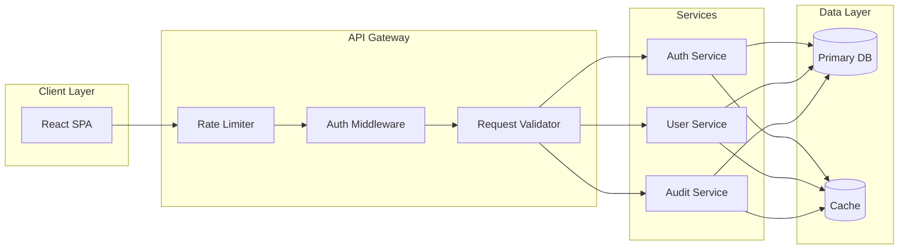
```mermaid
flowchart LR
    subgraph Client Layer
        A[React SPA]
    end
    subgraph API Gateway
        B[Rate Limiter]
        C[Auth Middleware]
        D[Request Validator]
    end
    subgraph Services
        E[Auth Service]
        F[User Service]
        G[Audit Service]
    end
    subgraph Data Layer
        H[(Primary DB)]
        I[(Cache)]
    end
    A --> B --> C --> D
    D --> E & F & G
    E & F & G --> H
    E & F & G --> I
```

# 4. TECHNOLOGY STACK

## 4.1 PROGRAMMING LANGUAGES

| Platform | Language | Version | Justification |
|----------|----------|---------|---------------|
| Frontend | JavaScript (ES2022) | ECMAScript 2022 | - Native browser support<br>- Rich ecosystem<br>- React.js compatibility |
| Frontend | TypeScript | 5.0+ | - Type safety<br>- Enhanced IDE support<br>- Better maintainability |
| Backend | Node.js | 18.x LTS | - JavaScript ecosystem consistency<br>- Excellent async performance<br>- Rich npm package availability |

## 4.2 FRAMEWORKS & LIBRARIES

### Core Frontend Stack

| Component | Technology | Version | Purpose |
|-----------|------------|---------|----------|
| UI Framework | React.js | 18.x | - Component-based architecture<br>- Virtual DOM performance<br>- Large ecosystem |
| Styling | Tailwind UI | 3.x | - Pre-built components<br>- Utility-first CSS<br>- Responsive design system |
| State Management | React Query | 4.x | - Server state management<br>- Caching<br>- Real-time updates |
| Routing | React Router | 6.x | - Client-side routing<br>- Code splitting support<br>- Navigation management |

### Supporting Libraries

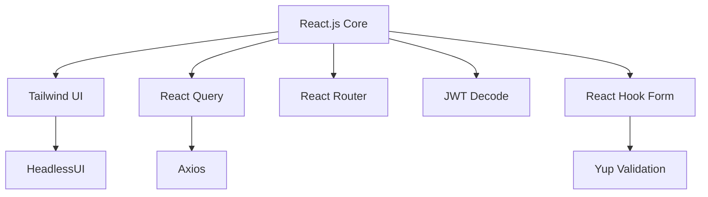
```mermaid
graph TD
    A[React.js Core] --> B[Tailwind UI]
    A --> C[React Query]
    A --> D[React Router]
    B --> E[HeadlessUI]
    C --> F[Axios]
    A --> G[JWT Decode]
    A --> H[React Hook Form]
    H --> I[Yup Validation]
```

## 4.3 DATABASES & STORAGE

### Primary Data Store

| Component | Technology | Purpose |
|-----------|------------|---------|
| Main Database | PostgreSQL 15+ | - ACID compliance<br>- Complex queries<br>- Data integrity |
| Cache Layer | Redis 7.x | - Session storage<br>- Real-time data<br>- Performance optimization |
| File Storage | S3-compatible | - User avatars<br>- Static assets<br>- Backup storage |

### Data Architecture

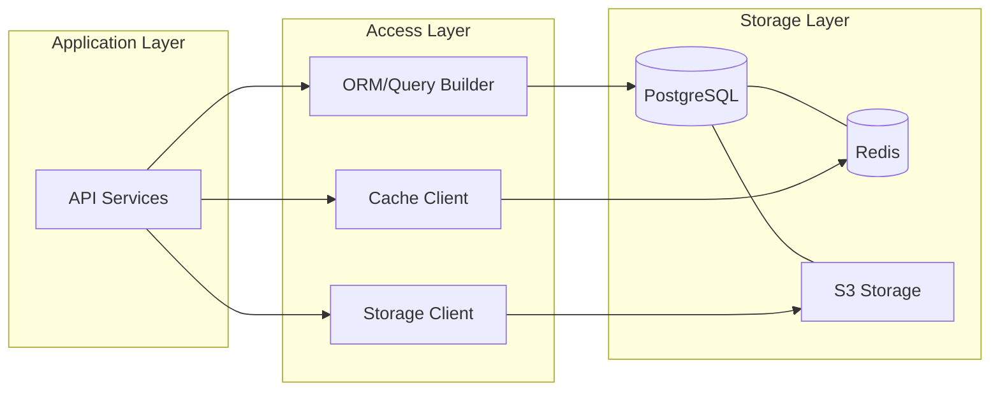
```mermaid
flowchart LR
    subgraph Storage Layer
        A[(PostgreSQL)] --- B[(Redis)]
        A --- C[S3 Storage]
    end
    subgraph Access Layer
        D[ORM/Query Builder]
        E[Cache Client]
        F[Storage Client]
    end
    subgraph Application Layer
        G[API Services]
    end
    D --> A
    E --> B
    F --> C
    G --> D & E & F
```

## 4.4 THIRD-PARTY SERVICES

| Service Category | Provider | Purpose |
|-----------------|----------|----------|
| Authentication | JWT | - Token-based auth<br>- Stateless sessions |
| Monitoring | New Relic | - Performance monitoring<br>- Error tracking |
| Analytics | Google Analytics | - User behavior<br>- Usage patterns |
| Cloud Platform | AWS | - Infrastructure hosting<br>- Scalability |

## 4.5 DEVELOPMENT & DEPLOYMENT

### Development Environment

| Tool | Version | Purpose |
|------|---------|----------|
| Node.js | 18.x LTS | Runtime environment |
| npm | 9.x | Package management |
| Git | 2.x | Version control |
| ESLint | 8.x | Code linting |
| Prettier | 3.x | Code formatting |

### Deployment Pipeline

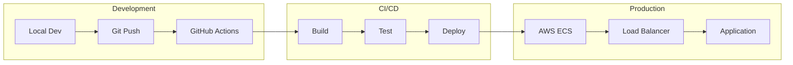
```mermaid
flowchart LR
    subgraph Development
        A[Local Dev] --> B[Git Push]
        B --> C[GitHub Actions]
    end
    subgraph CI/CD
        C --> D[Build]
        D --> E[Test]
        E --> F[Deploy]
    end
    subgraph Production
        F --> G[AWS ECS]
        G --> H[Load Balancer]
        H --> I[Application]
    end
```

### Build System

| Stage | Tool | Configuration |
|-------|------|---------------|
| Bundling | Vite | - ES modules<br>- Tree shaking<br>- Code splitting |
| Testing | Jest/RTL | - Unit tests<br>- Integration tests |
| Optimization | TerserPlugin | - Code minification<br>- Dead code elimination |
| Containerization | Docker | - Multi-stage builds<br>- Production optimization |

# 5. SYSTEM DESIGN

## 5.1 USER INTERFACE DESIGN

### Component Hierarchy

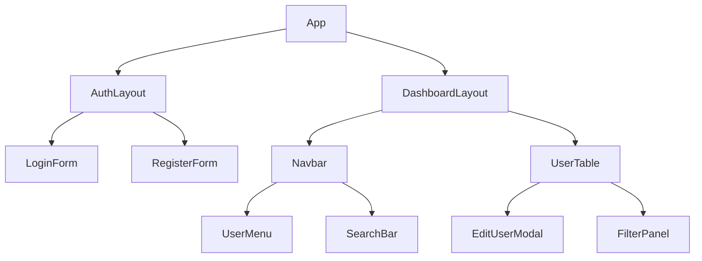
```mermaid
graph TD
    A[App] --> B[AuthLayout]
    A --> C[DashboardLayout]
    B --> D[LoginForm]
    B --> E[RegisterForm]
    C --> F[Navbar]
    C --> G[UserTable]
    G --> H[EditUserModal]
    G --> I[FilterPanel]
    F --> J[UserMenu]
    F --> K[SearchBar]
```

### Layout Specifications

| Component | Description | Behavior |
|-----------|-------------|-----------|
| AuthLayout | Authentication wrapper | - Centered card layout<br>- Full viewport height<br>- Background pattern |
| DashboardLayout | Main application layout | - Fixed navbar<br>- Responsive padding<br>- Content max-width |
| UserTable | Data display component | - Sticky header<br>- Zebra striping<br>- Row hover effects |
| EditUserModal | Edit form overlay | - Backdrop blur<br>- Form validation<br>- Loading states |

### State Flow

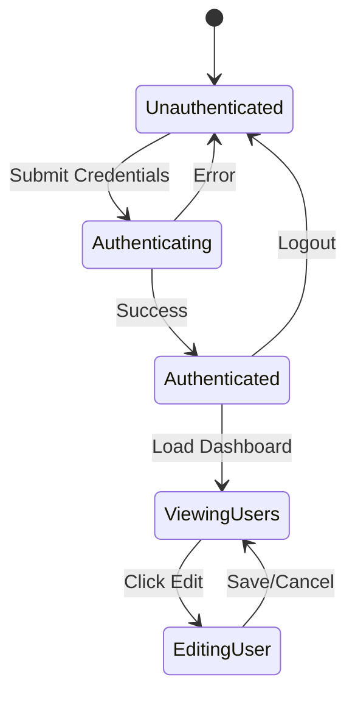
```mermaid
stateDiagram-v2
    [*] --> Unauthenticated
    Unauthenticated --> Authenticating: Submit Credentials
    Authenticating --> Authenticated: Success
    Authenticating --> Unauthenticated: Error
    Authenticated --> ViewingUsers: Load Dashboard
    ViewingUsers --> EditingUser: Click Edit
    EditingUser --> ViewingUsers: Save/Cancel
    Authenticated --> Unauthenticated: Logout
```

## 5.2 DATABASE DESIGN

### Schema Design

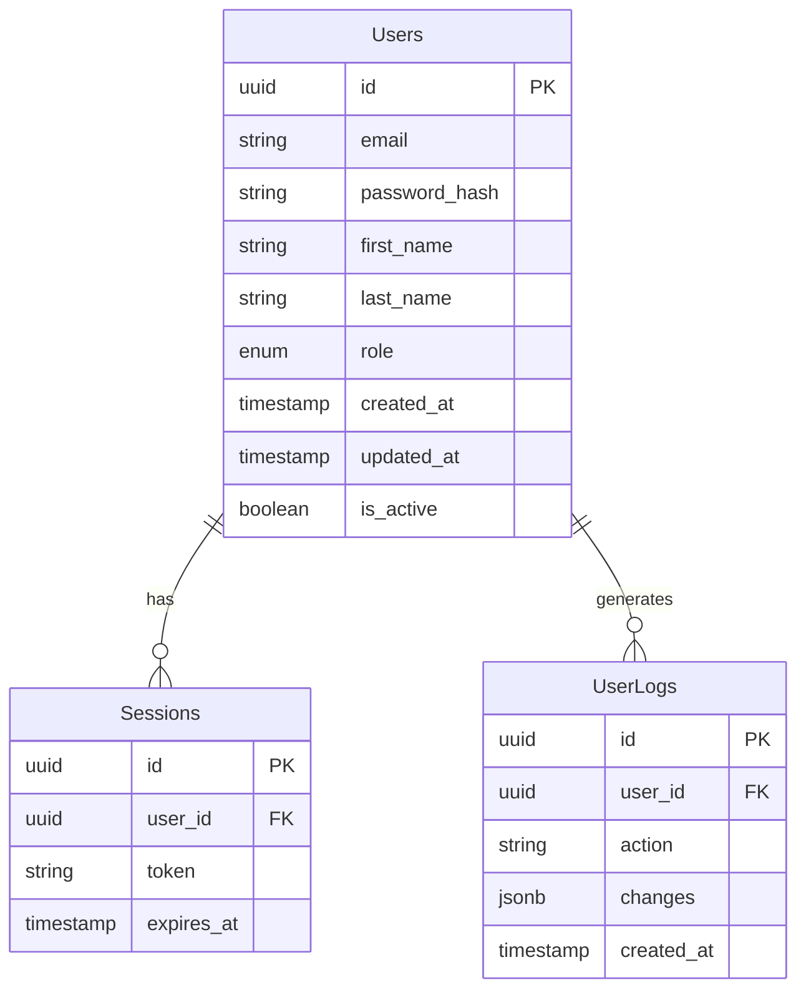
```mermaid
erDiagram
    Users ||--o{ Sessions : has
    Users ||--o{ UserLogs : generates
    Users {
        uuid id PK
        string email
        string password_hash
        string first_name
        string last_name
        enum role
        timestamp created_at
        timestamp updated_at
        boolean is_active
    }
    Sessions {
        uuid id PK
        uuid user_id FK
        string token
        timestamp expires_at
    }
    UserLogs {
        uuid id PK
        uuid user_id FK
        string action
        jsonb changes
        timestamp created_at
    }
```

### Data Access Patterns

| Operation | Access Pattern | Optimization |
|-----------|---------------|--------------|
| User Lookup | Email index | B-tree index on email |
| Session Validation | Token lookup | Redis caching |
| User List | Paginated query | Composite index on role, created_at |
| Audit Trail | Time-based query | Partitioning by date |

## 5.3 API DESIGN

### Authentication Flow

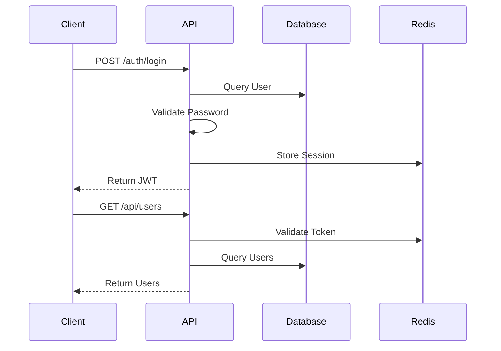
```mermaid
sequenceDiagram
    participant C as Client
    participant A as API
    participant D as Database
    participant R as Redis

    C->>A: POST /auth/login
    A->>D: Query User
    A->>A: Validate Password
    A->>R: Store Session
    A-->>C: Return JWT
    
    C->>A: GET /api/users
    A->>R: Validate Token
    A->>D: Query Users
    A-->>C: Return Users
```

### API Endpoints

| Endpoint | Method | Request Body | Response |
|----------|--------|--------------|----------|
| /auth/login | POST | `{email, password}` | `{token, user}` |
| /auth/register | POST | `{email, password, name}` | `{token, user}` |
| /api/users | GET | - | `{users: [], total}` |
| /api/users/:id | PUT | `{user data}` | `{user}` |

### Error Handling

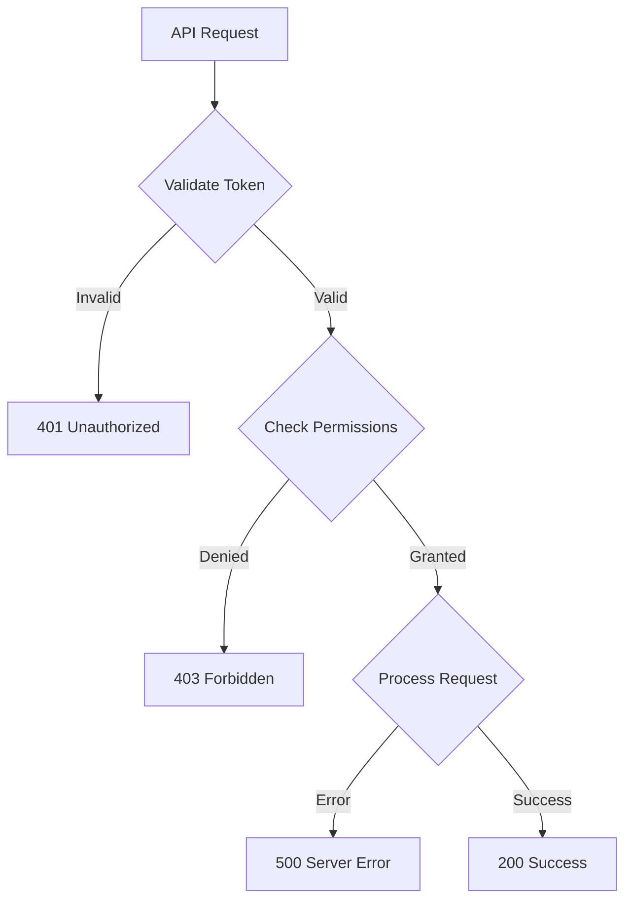
```mermaid
flowchart TD
    A[API Request] --> B{Validate Token}
    B -->|Invalid| C[401 Unauthorized]
    B -->|Valid| D{Check Permissions}
    D -->|Denied| E[403 Forbidden]
    D -->|Granted| F{Process Request}
    F -->|Error| G[500 Server Error]
    F -->|Success| H[200 Success]
```

## 5.4 SECURITY DESIGN

| Security Layer | Implementation | Purpose |
|----------------|----------------|----------|
| Authentication | JWT with refresh tokens | Identity verification |
| Authorization | Role-based access control | Permission management |
| Data Protection | Field-level encryption | Sensitive data security |
| API Security | Rate limiting, CORS | Request control |
| Session Management | Redis-based tracking | User session control |

## 5.5 PERFORMANCE OPTIMIZATION

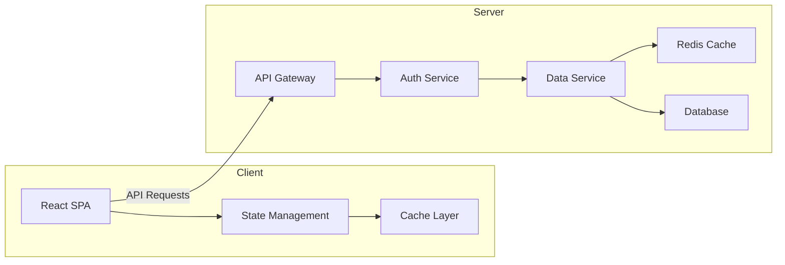
```mermaid
flowchart LR
    subgraph Client
        A[React SPA] --> B[State Management]
        B --> C[Cache Layer]
    end
    subgraph Server
        D[API Gateway] --> E[Auth Service]
        E --> F[Data Service]
        F --> G[Redis Cache]
        F --> H[Database]
    end
    A -->|API Requests| D
```

| Layer | Optimization | Impact |
|-------|-------------|---------|
| Frontend | React Query caching | Reduced API calls |
| API | Response compression | Smaller payload size |
| Database | Indexed queries | Faster data retrieval |
| Cache | Redis for sessions | Reduced latency |

# 6. USER INTERFACE DESIGN

## 6.1 WIREFRAME KEY

```
ICONS                    COMPONENTS              CONTAINERS
[?] Help                [ ] Checkbox            +------------------+
[$] Payment             ( ) Radio               |     Container    |
[i] Info               [...] Text Input         +------------------+
[+] Add                [===] Progress
[x] Close              [v] Dropdown             NAVIGATION
[<] [>] Navigate       [Button] Button          --> Flow direction
[^] Upload             {Table} Data Table       <-- Back flow
[#] Dashboard
[@] Profile            STATES                   HIERARCHY  
[!] Warning            * Required               +-- Parent
[=] Settings           ~ Loading                |   +-- Child
[*] Favorite           ! Error                  |   +-- Child
```

## 6.2 LOGIN SCREEN

```
+----------------------------------------+
|          User Management System         |
+----------------------------------------+
|                                        |
|            [@] Login Portal            |
|                                        |
|    Email*                              |
|    [..............................]    |
|                                        |
|    Password*                           |
|    [..............................]    |
|                                        |
|    [ ] Remember me                     |
|                                        |
|    [      Login Button     ]           |
|                                        |
|    [?] Forgot Password?                |
|    [+] Register New Account            |
|                                        |
+----------------------------------------+
```

## 6.3 MAIN DASHBOARD

```
+----------------------------------------+
| [@] John Doe    [#] Dashboard    [=]   |
+----------------------------------------+
|                                        |
| Users Management                   [+]  |
|                                        |
| Search: [.....................] [Button]|
|                                        |
| Filter by: [v Role] [v Status]         |
|                                        |
| {Table: Users}                         |
| +----------------------------------+   |
| | Name | Email | Role | Status | [=]|  |
| |------|-------|------|--------|----| |
| | John | ...   | Admin| Active |[=] | |
| | Jane | ...   | User | Active |[=] | |
| +----------------------------------+   |
|                                        |
| [<] 1 2 3 ... 10 [>]                  |
+----------------------------------------+
```

## 6.4 USER EDIT MODAL

```
+----------------------------------------+
|  Edit User                         [x]  |
+----------------------------------------+
|                                        |
| First Name*                            |
| [..............................]       |
|                                        |
| Last Name*                             |
| [..............................]       |
|                                        |
| Email*                                 |
| [..............................]       |
|                                        |
| Role*                                  |
| [v] Admin                              |
|     User                               |
|     Guest                              |
|                                        |
| Status                                 |
| (•) Active                             |
| ( ) Inactive                           |
|                                        |
| [    Cancel    ] [    Save    ]        |
|                                        |
+----------------------------------------+
```

## 6.5 RESPONSIVE LAYOUTS

### Mobile View (< 640px)
```
+------------------+
| [=] [@] Dashboard|
+------------------+
| Search:          |
| [.............]  |
|                  |
| Filter: [v]      |
|                  |
| {Stacked Cards}  |
| +-------------+  |
| | John Doe    |  |
| | Admin       |  |
| | [=] Actions |  |
| +-------------+  |
+------------------+
```

### Tablet View (640px - 1024px)
```
+--------------------------------+
| [@] Dashboard            [=]   |
+--------------------------------+
| Search: [...........] [Button] |
|                                |
| {2-Column Grid}                |
| +------------+ +------------+  |
| | User Card  | | User Card  |  |
| +------------+ +------------+  |
| +------------+ +------------+  |
| | User Card  | | User Card  |  |
| +------------+ +------------+  |
+--------------------------------+
```

## 6.6 INTERACTION STATES

### Loading State
```
+------------------+
|    Loading...    |
| [============  ] |
|      ~ 90%      |
+------------------+
```

### Error State
```
+------------------+
| [!] Error        |
| Invalid input    |
| [.......!......] |
| ! Required field |
+------------------+
```

### Success State
```
+------------------+
| [*] Success      |
| Changes saved    |
| [OK]             |
+------------------+
```

## 6.7 NAVIGATION FLOW

```mermaid
flowchart TD
    A[Login Screen] --> B{Authentication}
    B -->|Success| C[Dashboard]
    B -->|Failure| D[Error Message]
    C --> E[User Table]
    E --> F[Edit Modal]
    F -->|Save| G[Success Message]
    F -->|Cancel| E
    C --> H[User Profile]
    H --> C
```

## 6.8 COMPONENT HIERARCHY

```
+-- App Container
    +-- Authentication Layer
    |   +-- Login Form
    |   +-- Registration Form
    |
    +-- Dashboard Layout
        +-- Navigation Bar
        |   +-- User Menu
        |   +-- Search Bar
        |
        +-- Content Area
            +-- User Table
            |   +-- Table Headers
            |   +-- Table Rows
            |   +-- Pagination
            |
            +-- Edit Modal
                +-- Form Fields
                +-- Action Buttons
```

# 7. SECURITY CONSIDERATIONS

## 7.1 AUTHENTICATION AND AUTHORIZATION

### Authentication Flow

```mermaid
sequenceDiagram
    participant U as User
    participant F as Frontend
    participant A as Auth Service
    participant D as Database
    participant R as Redis Cache

    U->>F: Submit Credentials
    F->>A: POST /auth/login
    A->>D: Verify Credentials
    A->>A: Generate JWT + Refresh Token
    A->>R: Store Refresh Token
    A-->>F: Return JWT
    F->>F: Store JWT in Memory
    F-->>U: Redirect to Dashboard
```

### Authorization Matrix

| Role | View Users | Edit Users | Manage Roles | System Settings |
|------|------------|------------|--------------|-----------------|
| Admin | ✓ | ✓ | ✓ | ✓ |
| Manager | ✓ | ✓ | ✗ | ✗ |
| User | ✓ | Self Only | ✗ | ✗ |
| Guest | ✓ | ✗ | ✗ | ✗ |

### Token Management

| Token Type | Storage Location | Expiration | Renewal |
|------------|-----------------|------------|---------|
| JWT Access | Memory (React) | 15 minutes | Using refresh token |
| Refresh | HTTP-only Cookie | 7 days | Re-authentication |
| Password Reset | Database | 1 hour | New request required |

## 7.2 DATA SECURITY

### Data Protection Measures

```mermaid
flowchart TD
    A[User Data] --> B{Encryption Layer}
    B --> C[At Rest]
    B --> D[In Transit]
    C --> E[AES-256]
    D --> F[TLS 1.3]
    E --> G[Encrypted Storage]
    F --> H[Secure Transport]
    G --> I[Database]
    H --> J[API Endpoints]
```

### Sensitive Data Handling

| Data Type | Protection Method | Access Control |
|-----------|------------------|----------------|
| Passwords | Bcrypt (12 rounds) | Hash only, no retrieval |
| Personal Info | Field-level encryption | Role-based access |
| Session Data | Redis encryption | Token validation |
| API Keys | Vault storage | System processes only |
| Audit Logs | Immutable storage | Admin access only |

### Data Sanitization

| Input Type | Sanitization Method | Validation Rule |
|------------|-------------------|-----------------|
| User Input | XSS Prevention | HTML escape |
| File Uploads | MIME Validation | Whitelist formats |
| API Params | Type Checking | Schema validation |
| Database Queries | Parameterization | ORM escaping |

## 7.3 SECURITY PROTOCOLS

### API Security

```mermaid
flowchart LR
    A[API Request] --> B{Rate Limiter}
    B -->|Allowed| C{CORS Check}
    B -->|Blocked| D[429 Too Many Requests]
    C -->|Allowed| E{JWT Validation}
    C -->|Blocked| F[403 Forbidden]
    E -->|Valid| G[Process Request]
    E -->|Invalid| H[401 Unauthorized]
```

### Security Headers

| Header | Value | Purpose |
|--------|--------|---------|
| Content-Security-Policy | strict-src 'self' | Prevent XSS |
| X-Frame-Options | DENY | Prevent clickjacking |
| X-Content-Type-Options | nosniff | Prevent MIME sniffing |
| Strict-Transport-Security | max-age=31536000 | Force HTTPS |
| X-XSS-Protection | 1; mode=block | Browser XSS filter |

### Security Monitoring

| Component | Monitoring Method | Alert Threshold |
|-----------|------------------|-----------------|
| Failed Logins | Rate monitoring | >5 attempts/minute |
| API Usage | Request tracking | >100 requests/minute |
| Error Rates | Log analysis | >1% error rate |
| Data Access | Audit logging | Unauthorized attempts |
| System Health | Heartbeat check | <99.9% uptime |

### Compliance Measures

```mermaid
flowchart TD
    A[Security Requirements] --> B[GDPR]
    A --> C[CCPA]
    A --> D[SOC 2]
    B --> E[Data Protection]
    C --> E
    D --> E
    E --> F[Implementation]
    F --> G[User Consent]
    F --> H[Data Encryption]
    F --> I[Access Controls]
    F --> J[Audit Trails]
```

### Incident Response

| Phase | Action | Responsibility |
|-------|--------|---------------|
| Detection | Log monitoring | Security system |
| Analysis | Threat assessment | Security team |
| Containment | Access restriction | DevOps team |
| Eradication | Vulnerability patching | Development team |
| Recovery | System restoration | Operations team |
| Documentation | Incident reporting | Security team |

# 8. INFRASTRUCTURE

## 8.1 DEPLOYMENT ENVIRONMENT

### Environment Strategy

```mermaid
flowchart TD
    A[Development] --> B[Testing]
    B --> C[Staging]
    C --> D[Production]
    
    subgraph Development
    A1[Local Dev] --> A2[Dev Server]
    end
    
    subgraph Testing
    B1[Integration] --> B2[QA]
    end
    
    subgraph Production
    D1[Blue Deployment] --> D2[Green Deployment]
    end
```

| Environment | Infrastructure | Purpose | Scaling |
|-------------|---------------|----------|----------|
| Development | Local + Dev Server | Development and initial testing | Single instance |
| Testing | AWS ECS | Integration and QA testing | 2 instances |
| Staging | AWS ECS | Pre-production verification | Production mirror |
| Production | AWS ECS | Live system | Auto-scaling (2-10 instances) |

## 8.2 CLOUD SERVICES

### AWS Service Architecture

```mermaid
graph TD
    A[Route 53] --> B[CloudFront]
    B --> C[ALB]
    C --> D[ECS Cluster]
    D --> E[ECS Service]
    E --> F[ECS Tasks]
    F --> G[RDS]
    F --> H[ElastiCache]
    F --> I[S3]
```

| Service | Purpose | Configuration |
|---------|----------|--------------|
| Route 53 | DNS Management | Latency-based routing |
| CloudFront | CDN | Edge locations with SSL |
| ECS | Container Orchestration | Fargate serverless compute |
| RDS | Database | PostgreSQL 15 with Multi-AZ |
| ElastiCache | Redis Cache | Cluster mode enabled |
| S3 | Static Assets | Versioned buckets with CDN |

## 8.3 CONTAINERIZATION

### Docker Configuration

```mermaid
graph LR
    A[Source Code] --> B[Docker Build]
    B --> C[Base Image]
    C --> D[Dependencies]
    D --> E[Application Code]
    E --> F[Final Image]
    F --> G[Container Registry]
```

| Component | Specification | Purpose |
|-----------|--------------|----------|
| Base Image | node:18-alpine | Minimal Node.js runtime |
| Build Stage | Multi-stage build | Optimize image size |
| Runtime | Node.js production | Minimal runtime dependencies |
| Exposed Port | 3000 | Application port |
| Health Check | /health endpoint | Container health monitoring |

## 8.4 ORCHESTRATION

### ECS Configuration

```mermaid
graph TD
    A[ECS Cluster] --> B[Service Definition]
    B --> C[Task Definition]
    C --> D[Container Definition]
    D --> E[Auto Scaling]
    E --> F[Load Balancing]
    F --> G[Service Discovery]
```

| Component | Configuration | Scaling Rules |
|-----------|--------------|---------------|
| Task Definition | 1 vCPU, 2GB RAM | Resource limits |
| Service | Minimum 2 tasks | High availability |
| Auto Scaling | 40-80% CPU utilization | Scale 2-10 instances |
| Load Balancer | Application Load Balancer | Health checks every 30s |

## 8.5 CI/CD PIPELINE

### Pipeline Architecture

```mermaid
flowchart LR
    A[GitHub] -->|Push| B[GitHub Actions]
    B -->|Build| C[Test]
    C -->|Success| D[Build Image]
    D -->|Push| E[ECR]
    E -->|Deploy| F[ECS]
    F -->|Blue/Green| G[Production]
```

| Stage | Tools | Actions |
|-------|-------|---------|
| Source Control | GitHub | Feature branches, PR reviews |
| CI | GitHub Actions | Build, test, lint, security scan |
| Registry | Amazon ECR | Image versioning and scanning |
| CD | AWS CodeDeploy | Blue/green deployment |
| Monitoring | CloudWatch | Logs, metrics, alerts |

### Deployment Strategy

| Type | Implementation | Rollback Strategy |
|------|----------------|-------------------|
| Blue/Green | Zero-downtime deployment | Instant switch to previous version |
| Canary | 10% traffic shift | Gradual rollout with monitoring |
| Feature Flags | LaunchDarkly | Runtime feature control |
| Database | Forward-only migrations | Backup point-in-time recovery |

# 9. APPENDICES

## 9.1 GLOSSARY

| Term | Definition |
|------|------------|
| Access Token | Short-lived authentication credential used to access protected resources |
| Refresh Token | Long-lived token used to obtain new access tokens |
| Middleware | Software that acts as a bridge between the application and database |
| Hydration | Process of attaching event listeners to server-rendered HTML |
| Hot Module Replacement | Development feature that updates modules without page refresh |
| Code Splitting | Technique to split code into smaller chunks for better performance |
| Tree Shaking | Dead code elimination during the build process |
| Memoization | Optimization technique that caches expensive function calls |
| Debouncing | Technique to limit the rate at which a function is called |
| Throttling | Controlling the rate of execution of a function |

## 9.2 ACRONYMS

| Acronym | Full Form |
|---------|-----------|
| AJAX | Asynchronous JavaScript and XML |
| CDN | Content Delivery Network |
| CRUD | Create, Read, Update, Delete |
| DRY | Don't Repeat Yourself |
| ESM | ECMAScript Modules |
| JWT | JSON Web Token |
| ORM | Object-Relational Mapping |
| RBAC | Role-Based Access Control |
| SSR | Server-Side Rendering |
| TLS | Transport Layer Security |
| URI | Uniform Resource Identifier |
| XHR | XMLHttpRequest |

## 9.3 DEVELOPMENT WORKFLOW

```mermaid
flowchart TD
    A[Local Development] -->|Git Push| B[Feature Branch]
    B -->|Pull Request| C[Code Review]
    C -->|Approved| D[Merge to Main]
    D -->|Trigger| E[CI Pipeline]
    E -->|Tests Pass| F[Build]
    F -->|Success| G[Deploy to Staging]
    G -->|QA Approval| H[Deploy to Production]
    H -->|Monitor| I[Production Metrics]
    I -->|Issues| J[Hotfix]
    J -->|Fix| D
```

## 9.4 ERROR HANDLING HIERARCHY

```mermaid
flowchart TD
    A[Application Error] -->|Catch| B{Error Type}
    B -->|Network| C[Network Error Handler]
    B -->|Authentication| D[Auth Error Handler]
    B -->|Validation| E[Form Error Handler]
    B -->|Server| F[API Error Handler]
    B -->|Unknown| G[Generic Error Handler]
    C & D & E & F & G -->|Process| H[Error Logger]
    H -->|Display| I[User Notification]
    H -->|Record| J[Error Analytics]
```

## 9.5 PERFORMANCE OPTIMIZATION CHECKLIST

| Category | Optimization Technique | Implementation |
|----------|----------------------|----------------|
| Bundle Size | Code splitting | React.lazy() for route-based splitting |
| | Tree shaking | ES modules with side-effect free imports |
| | Asset optimization | Image compression and lazy loading |
| Runtime | Component memoization | React.memo() for expensive renders |
| | Virtual scrolling | React-window for large lists |
| | Debounced search | useDebounce hook for search inputs |
| Caching | API response caching | React Query with staleTime configuration |
| | Static asset caching | CDN with proper cache headers |
| | Route pre-fetching | React Router prefetch data hooks |

## 9.6 SECURITY MEASURES

| Security Layer | Implementation | Purpose |
|----------------|---------------|----------|
| Input Validation | Yup schema validation | Prevent malicious input |
| XSS Prevention | React's built-in escaping | Prevent script injection |
| CSRF Protection | Custom request headers | Prevent cross-site requests |
| Content Security | Strict CSP headers | Control resource loading |
| Authentication | HTTP-only cookies | Secure token storage |
| Rate Limiting | Token bucket algorithm | Prevent abuse |

## 9.7 BROWSER COMPATIBILITY

```mermaid
graph TD
    A[Browser Support] --> B[Modern Browsers]
    B --> C[Chrome Latest 2]
    B --> D[Firefox Latest 2]
    B --> E[Safari Latest 2]
    B --> F[Edge Latest 2]
    A --> G[Progressive Enhancement]
    G --> H[Core Functionality]
    G --> I[Enhanced Features]
    A --> J[Fallback Strategies]
    J --> K[Polyfills]
    J --> L[Graceful Degradation]
```

## 9.8 TESTING STRATEGY

| Test Type | Tool | Coverage Requirements |
|-----------|------|---------------------|
| Unit Tests | Jest | 80% code coverage |
| Component Tests | React Testing Library | Critical components |
| Integration Tests | Cypress | Main user flows |
| E2E Tests | Playwright | Core business flows |
| Performance Tests | Lighthouse | Score > 90 |
| Accessibility Tests | axe-core | WCAG 2.1 AA |